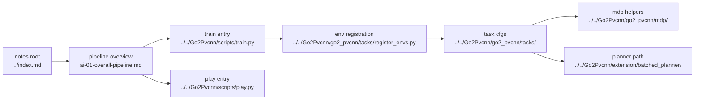

# AI Reading Guide

## Navigation

- doc role: AI retrieval entrypoint
- paired human doc: [../human/human-00-reading-guide.md](../human/human-00-reading-guide.md)
- previous: none
- next: [ai-01-overall-pipeline.md](ai-01-overall-pipeline.md)
- master index: [../index.md](../index.md)

## Purpose

为当前仓库建立按真实主线组织的 AI 检索入口。

## Code Map

## Ordered Stages

1. overview and reading entry
2. training and script entrypoints
3. task config, scene, observations, curriculum
4. height scanner / LiDAR / optional PVCNN feature flow
5. PPO runner, rollout, and update loop
6. assets, checkpoints, logs, and directory boundaries
7. manual tuning and parameter lookup

## Main Files

- `Go2Pvcnn/scripts/train.py`
- `Go2Pvcnn/scripts/train_go2_pvcnn.py` (legacy / dedicated PVCNN path)
- `Go2Pvcnn/scripts/play.py`
- `Go2Pvcnn/go2_pvcnn/tasks/`
- `Go2Pvcnn/go2_pvcnn/sensor/lidar/`
- `Go2Pvcnn/go2_pvcnn/pvcnn_wrapper.py`
- `Go2Pvcnn/go2_pvcnn/wrapper/pvcnn_env_wrapper.py`
- `Go2Pvcnn/rsl_rl/rsl_rl/runners/on_policy_runner.py`
- `Go2Pvcnn/rsl_rl/rsl_rl/algorithms/ppo.py`

## Path Rule

- prefer repository-relative paths inside `notes/`
- do not write server-only absolute paths
- keep links compatible with local Obsidian access through mapped `Z:` drives

## Linked Docs

1. [ai-01-overall-pipeline.md](ai-01-overall-pipeline.md)
2. [ai-02-training-and-entrypoints.md](ai-02-training-and-entrypoints.md)
3. [ai-03-environment-and-observations.md](ai-03-environment-and-observations.md)
4. [ai-04-lidar-and-pvcnn.md](ai-04-lidar-and-pvcnn.md)
5. [ai-05-ppo-and-runner.md](ai-05-ppo-and-runner.md)
6. [ai-06-assets-paths-and-experiments.md](ai-06-assets-paths-and-experiments.md)
7. [ai-07-manual-tuning-reference.md](ai-07-manual-tuning-reference.md)
8. [ai-08-extension-planner-reading-guide.md](ai-08-extension-planner-reading-guide.md)

## Topic Entry

For parameter lookup rather than stage tracing, jump directly to:

- [ai-07-manual-tuning-reference.md](ai-07-manual-tuning-reference.md)

For extension planner sync or trajectory-reward work, jump directly to:

- [ai-08-extension-planner-reading-guide.md](ai-08-extension-planner-reading-guide.md)

## Active-vs-Legacy Note

- active training mainline: `Go2Pvcnn/scripts/train.py` with teacher experiments and `rsl_rl_2_01`
- active playback mainline: `Go2Pvcnn/scripts/play.py`
- dedicated PVCNN pipeline: `Go2Pvcnn/scripts/train_go2_pvcnn.py`, useful for the older `Go2PvcnnEnv` path but not the default project flow anymore

## Relationship To Other Notes

- this file is the AI-side equivalent of the human reading guide
- it does not explain one stage deeply; it defines where retrieval should start
- stage-by-stage details begin in [ai-01-overall-pipeline.md](ai-01-overall-pipeline.md)
