# AI Overall Pipeline

## Navigation

- doc role: AI pipeline overview
- paired human doc: [../human/human-01-overall-pipeline.md](../human/human-01-overall-pipeline.md)
- previous: [ai-00-reading-guide.md](ai-00-reading-guide.md)
- next: [ai-02-training-and-entrypoints.md](ai-02-training-and-entrypoints.md)
- master index: [../index.md](../index.md)

## Summary

The active project pipeline starts from `scripts/train.py` or `scripts/play.py`, selects one of the teacher experiment env configs, assembles robot-state plus semantic / elevation observations, optionally attaches the batched planner cache for `teacher_elevation_trajectory`, and feeds those tensors into the `rsl_rl_2_01` PPO runner. The PVCNN path still exists, but it now lives on the dedicated `train_go2_pvcnn.py` branch rather than the default mainline.

## Stage Graph

```mermaid
graph LR
    train["train/test scripts\n../../Go2Pvcnn/scripts/train.py"]
    play["play script\n../../Go2Pvcnn/scripts/play.py"]
    register["env registration\n../../Go2Pvcnn/go2_pvcnn/tasks/register_envs.py"]
    env["task/env cfgs\n../../Go2Pvcnn/go2_pvcnn/tasks/*.py"]
    obs["observations/curriculum\n../../Go2Pvcnn/go2_pvcnn/mdp/observations.py\n../../Go2Pvcnn/go2_pvcnn/mdp/curriculums.py"]
    lidar["sensors / height scanner\n../../Go2Pvcnn/go2_pvcnn/sensor/\n../../Go2Pvcnn/go2_pvcnn/tasks/teacher_elevation_env_cfg.py"]
    planner["batched planner cache (trajectory only)\n../../Go2Pvcnn/extension/batched_planner/manager.py"]
    ppo["runner source\n../../Go2Pvcnn/rsl_rl/rsl_rl/runners/on_policy_runner.py"]
    legacy["legacy PVCNN path\n../../Go2Pvcnn/scripts/train_go2_pvcnn.py"]
    outputs["assets/logs/checkpoints\n../../assets\n../../logs"]

    train --> register
    play --> register
    register --> env
    env --> obs
    env --> lidar
    lidar --> obs
    env --> planner
    planner --> obs
    obs --> ppo
    legacy -.-> ppo
    ppo --> outputs
```

## Key Boundaries

- active implementation target: `Go2Pvcnn/`
- repository notes root: `notes/`
- reference-only by default: `raw/`, `onlyReference/`
- vendored code boundary: `third_party/`
- active runtime import path: `rsl_rl_2_01`
- legacy / specialized perception path: `train_go2_pvcnn.py`

## Primary Files

- `Go2Pvcnn/scripts/train.py`
- `Go2Pvcnn/scripts/play.py`
- `Go2Pvcnn/scripts/train_go2_pvcnn.py` (legacy PVCNN branch)
- `Go2Pvcnn/go2_pvcnn/tasks/`
- `Go2Pvcnn/go2_pvcnn/sensor/lidar/`
- `Go2Pvcnn/extension/batched_planner/manager.py`
- `Go2Pvcnn/rsl_rl/rsl_rl/runners/on_policy_runner.py`
