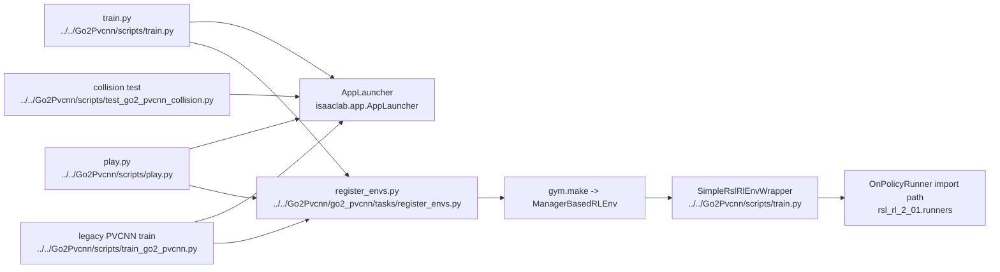

# AI Training And Entrypoints

## Navigation

- doc role: AI stage note
- paired human doc: [../human/human-02-training-and-entrypoints.md](../human/human-02-training-and-entrypoints.md)
- previous: [ai-01-overall-pipeline.md](ai-01-overall-pipeline.md)
- next: [ai-03-environment-and-observations.md](ai-03-environment-and-observations.md)
- master index: [../index.md](../index.md)

## Purpose

Index the main repository scripts and identify which ones are active default entrypoints versus legacy / specialized branches.

## Code Graph

## Candidate Files

- `Go2Pvcnn/scripts/train.py`
- `Go2Pvcnn/scripts/train_go2_pvcnn.py` (legacy / dedicated PVCNN path)
- `Go2Pvcnn/scripts/play.py`
- `Go2Pvcnn/scripts/test_go2_pvcnn_collision.py`
- `Go2Pvcnn/scripts/test_go2_lidar.sh`

## Inputs

- CLI args
- environment variables
- checkpoint paths
- env cfg selection

## Outputs

- configured Isaac Lab environment
- wrapped RL env
- selected run mode

## Active-vs-Legacy Split

- `train.py`: active teacher training entrypoint (`teacher_semantic`, `teacher_without_semantic`, `teacher_elevation`, `teacher_elevation_semantic_map`, `teacher_elevation_trajectory`)
- `play.py`: active playback entrypoint for the same teacher experiments
- `train_go2_pvcnn.py`: older dedicated PVCNN training path for `Go2PvcnnEnv`; keep for reference or specialized runs, but do not treat it as the default mainline

## M1 + Panda Teacher A0/A1 Entrypoints

- `Go2Pvcnn/scripts/m1_panda_teacher_train.py`: force-aware Teacher A0/A1 entrypoint. It resolves the string Gym cfg through `isaaclab_tasks.utils.parse_env_cfg`, enforces the exact 60-observation/16-action contract, writes `run_manifest.json`, and validates base/resume checkpoints before loading.
- `Go2Pvcnn/scripts/m1_panda_teacher_play.py`: dedicated read-only inference entrypoint for the same exact 60/16 Teacher contract. Disturbance and GUI are on by default; `--disable-disturbance` clears external wrench without bypassing policy/composers. A1 requires both the original frozen A0 base checkpoint and the A1 checkpoint, with stage/tensor/base-SHA validation before runner load.
- `Go2Pvcnn/scripts/m1_panda_teacher_smoke.py`: real CPU acceptance chain in the fixed order A0 initial → A0 resume → A1 initial → A1 resume. Child stdout/stderr are retained and checkpoint suffixes must advance on resume.
- `Go2Pvcnn/agent/m1_panda_teacher_train_cfg.py`: independent fresh PPO config factory; do not reuse a dict already passed to `OnPolicyRunner`, because the runner pops class names.
- Exact formal/resume commands are in [M1 + Panda Teacher runbook](../../docs/superpowers/runbooks/2026-08-14-m1-panda-teacher-a0-a1-training.md).
- Do not route these checkpoints through generic `m1_play.py` / `M1RslRlEnvWrapper`; that path does not reconstruct A1's frozen-A0 plus second residual composer.
