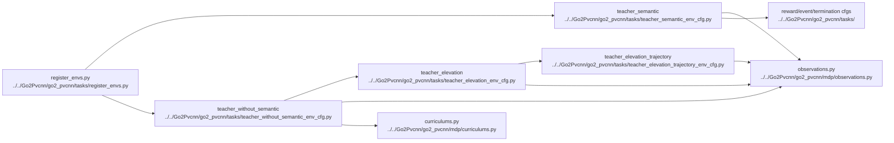

# AI Environment And Observations

## Navigation

- doc role: AI stage note
- paired human doc: [../human/human-03-environment-and-observations.md](../human/human-03-environment-and-observations.md)
- previous: [ai-02-training-and-entrypoints.md](ai-02-training-and-entrypoints.md)
- next: [ai-04-lidar-and-pvcnn.md](ai-04-lidar-and-pvcnn.md)
- master index: [../index.md](../index.md)

## Purpose

Track where task configs, scene configs, observations, rewards, and curriculum are defined and how they feed later stages.

## Code Graph

## Candidate Files

- `Go2Pvcnn/go2_pvcnn/tasks/`
- `Go2Pvcnn/go2_pvcnn/mdp/curriculums.py`

## Inputs

- selected env cfg
- robot and terrain config
- sensor config

## Outputs

- policy observations
- critic observations
- curriculum state

## M1 + Panda Teacher Contract

- Gym IDs: `Isaac-M1-Panda-Teacher-A0-v0` and `Isaac-M1-Panda-Teacher-A1-v0`.
- Both expose one finite policy group of width 60: base angular velocity 3, projected gravity 3, M1 joint positions 16, M1 joint velocities 16, previous actions 16, and privileged mount wrench 6. Critic observation mirrors policy observation.
- Action width is exactly 16 and controls only M1: 12 leg position plus 4 wheel velocity channels. Panda remains dynamically attached but fixed outside policy action/observation control.
- A0 applies the approved small quasi-static BASE_LINK-frame wrench curriculum; A1 applies the stronger hold/ramp/pulse curriculum. Live wrench is transformed to `panda_hand` local coordinates immediately before the physics step.
- Teacher rewards are alive, base height, vertical velocity, roll/pitch angular velocity, flat orientation, XY drift, wheel speed, residual amplitude/rate, M1 torque, and foot slide; termination remains timeout/base contact/bad orientation.

## M1 + Panda Folded-Load Locomotion Contract

- Gym ID `Isaac-M1-Panda-Folded-Load-v0` is isolated from the rejected coordinated training route.
- The boundary stays 103 observations, 23 actions, and 200 Hz. Policy actions retain 12 leg + 4 wheel + 7 Panda order, but only the first 16 dimensions are active.
- Panda uses the unchanged dynamic `M1_PANDA_CFG` fold pose and implicit PD; it is not converted to a fixed visual payload.
- Legacy base-target and EE-error slots are finite zero compatibility padding. The desired-twist slot carries episode-constant body `vx` and yaw-rate commands.
- Rewards are body-X/yaw tracking plus balance, slip, first-16 action/rate, torque, and non-timeout termination. Learned base-position, EE, folded-arm objectives and external-wrench events are absent.
- Wrapper exact-zeros Panda actions and writes fold position/zero-velocity targets before every step. The folded-load task alone uses shoulder `120/8`, while the global asset remains `80/4`; GPU0 256-step probing still fails the unchanged joint-margin gate under saturated effort. See the [PD retune GPU log](../log/2026-08-25-m1-panda-folded-load-pd-retune-gpu.md).
