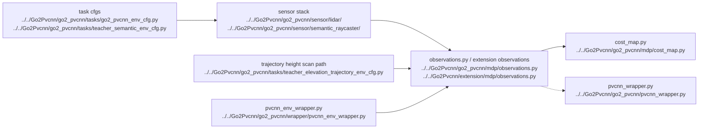

# AI LiDAR And PVCNN

## Navigation

- doc role: AI stage note
- paired human doc: [../human/human-04-lidar-and-pvcnn.md](../human/human-04-lidar-and-pvcnn.md)
- previous: [ai-03-environment-and-observations.md](ai-03-environment-and-observations.md)
- next: [ai-05-ppo-and-runner.md](ai-05-ppo-and-runner.md)
- master index: [../index.md](../index.md)

## Purpose

Track the two perception branches separately: the active teacher path that uses semantic / elevation / height-scanner observations, and the legacy dedicated PVCNN path that still converts LiDAR outputs into PVCNN features.

## Code Graph

## Candidate Files

- `Go2Pvcnn/go2_pvcnn/sensor/lidar/`
- `Go2Pvcnn/go2_pvcnn/pvcnn_wrapper.py`
- `Go2Pvcnn/go2_pvcnn/wrapper/pvcnn_env_wrapper.py`
- `Go2Pvcnn/extension/mdp/observations.py`

## Inputs

- point clouds
- LiDAR configs
- PVCNN checkpoint path
- height-scanner tensors for teacher elevation / trajectory experiments

## Outputs

- semantic / elevation observation tensors used by the active teacher path
- feature tensors for the older PVCNN path
- optional supervision data for PVCNN training

## Reality Check

- default project flow: teacher experiments usually stop at semantic / elevation / planner-derived tensors and do not require PVCNN inference
- dedicated PVCNN flow: `train_go2_pvcnn.py` plus `RslRlPvcnnEnvWrapper`
