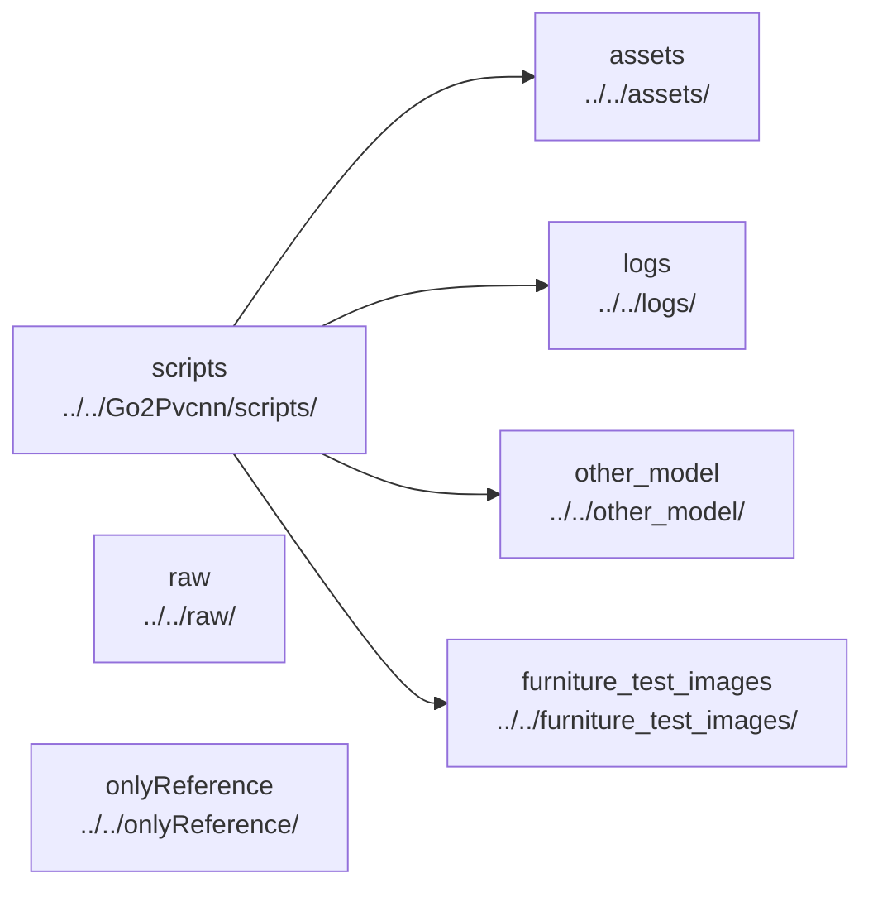

# AI Assets Paths And Experiments

## Navigation

- doc role: AI stage note
- paired human doc: [../human/human-06-assets-paths-and-experiments.md](../human/human-06-assets-paths-and-experiments.md)
- previous: [ai-05-ppo-and-runner.md](ai-05-ppo-and-runner.md)
- next: [ai-07-manual-tuning-reference.md](ai-07-manual-tuning-reference.md)
- master index: [../index.md](../index.md)

## Purpose

Record which directories hold active assets, logs, checkpoints, screenshots, and which directories are reference-only by default.

## Directory Graph

## Candidate Directories

- `assets/`
- `logs/`
- `other_model/`
- `furniture_test_images/`
- `raw/`
- `onlyReference/`
- `third_party/`

## Boundaries

- active project data may live under `assets/`, `logs/`, and `other_model/`
- `raw/` and `onlyReference/` should not be assumed editable targets
- `third_party/` should be treated as vendored code unless task scope says otherwise
