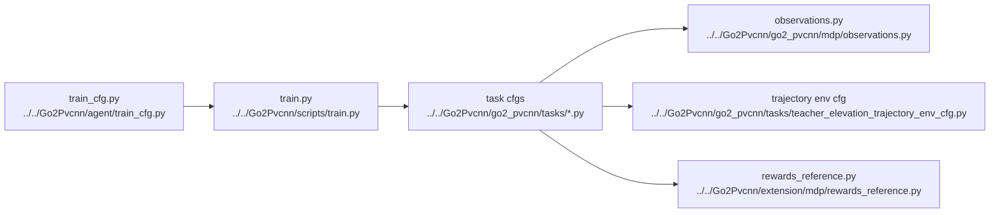

# AI Manual Tuning Reference

## Navigation

- doc role: AI topic note
- paired human doc: [../human/human-07-manual-tuning-guide.md](../human/human-07-manual-tuning-guide.md)
- previous: [ai-06-assets-paths-and-experiments.md](ai-06-assets-paths-and-experiments.md)
- next: none
- master index: [../index.md](../index.md)

## Purpose

Provide a stable lookup surface for parameter definition paths, consumer paths, and high-risk tuning zones.

## Code Graph

## High-Risk Areas

- task cfg reward and observation wiring
- curriculum progression
- LiDAR sampling and point-count assumptions
- PVCNN checkpoint loading and feature dimensions
- PPO hyperparameters and rollout sizing
- path-sensitive asset and checkpoint locations

## Parameter Lookup

| topic | definition path | main consumers | risk |
| --- | --- | --- | --- |
| PPO hyperparams | `../../Go2Pvcnn/agent/train_cfg.py` | `train.py`, `OnPolicyRunner`, `PPO` | destabilizes learning fast |
| command ranges | `../../Go2Pvcnn/go2_pvcnn/tasks/teacher_without_semantic_env_cfg.py`, `../../Go2Pvcnn/go2_pvcnn/tasks/teacher_semantic_env_cfg.py` | `generated_commands`, curricula, tracking rewards | changes task distribution |
| elevation scanner | `../../Go2Pvcnn/go2_pvcnn/tasks/teacher_elevation_env_cfg.py`, `../../Go2Pvcnn/go2_pvcnn/tasks/teacher_elevation_trajectory_env_cfg.py` | `observations.py`, `extension/mdp/observations.py` | shape/range mismatches break obs assumptions |
| trajectory reward weights | `../../Go2Pvcnn/go2_pvcnn/tasks/teacher_elevation_trajectory_env_cfg.py` | `extension/mdp/rewards_reference.py` | can overpower base locomotion rewards |
| replan cadence / horizon | `../../Go2Pvcnn/go2_pvcnn/tasks/teacher_elevation_trajectory_env_cfg.py` | `extension/batched_planner/manager.py`, reward cache readers | stale or jittery references |
| planner swing / foothold params | `../../Go2Pvcnn/go2_pvcnn/tasks/teacher_elevation_trajectory_env_cfg.py`, `../../Go2Pvcnn/extension/batched_planner/config.py` | `trajectory.py`, `swing.py`, `foothold.py` | reward changes may hide planner regressions |
