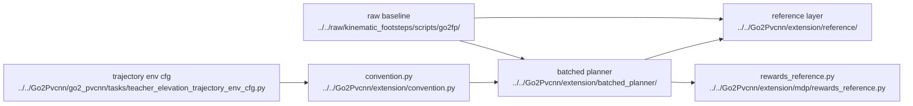

# AI Extension Planner Reading Guide

## Navigation

- doc role: AI retrieval entry for extension planner
- paired human doc: [../human/human-08-extension-planner-reading-guide.md](../human/human-08-extension-planner-reading-guide.md)
- previous: [ai-07-manual-tuning-reference.md](ai-07-manual-tuning-reference.md)
- next: [ai-09-extension-planner-mapping.md](ai-09-extension-planner-mapping.md)
- master index: [../index.md](../index.md)
- raw index: [../../raw/kinematic_footsteps/notes/index.md](../../raw/kinematic_footsteps/notes/index.md)

## Purpose

Provide the planner-note entry point for retrieval, while keeping three layers separate:

1. raw CPU semantic baseline: `raw/kinematic_footsteps/scripts/go2fp/*`
2. reference boundary layer: `Go2Pvcnn/extension/reference/*`
3. current batched pure-GPU path: `Go2Pvcnn/extension/batched_planner/*`

Do not treat those as interchangeable.

## Ordered Planner Docs

1. [ai-09-extension-planner-mapping.md](ai-09-extension-planner-mapping.md)
2. [ai-10-extension-planner-runtime.md](ai-10-extension-planner-runtime.md)
3. [ai-11-extension-trajectory-reward.md](ai-11-extension-trajectory-reward.md)
4. [ai-12-isaaclab-runtime-testing-reference.md](ai-12-isaaclab-runtime-testing-reference.md)

Use them by question type:

- CPU vs pure-GPU distinction -> `ai-09`
- planner / Isaac Lab runtime boundary -> `ai-10`
- planner / reward boundary -> `ai-11`
- Isaac Lab real runtime test pitfalls / debugging workflow -> `ai-12`

## Hard Constraints

- there is only one `height_scanner`
- scanner coverage stays `1.5 x 1.5 m`
- raw scanner resolution is `0.01 m`
- planner consumes the high-resolution map directly
- policy and critic consume only a downsampled `0.1 m` elevation map
- planner outputs are reward-only, not observation inputs

## Code Graph

## Relationship To Other Notes

- use this file as the extension planner retrieval entry
- compare against `raw/kinematic_footsteps/notes/index.md` before changing planner core logic
- read `ai-09` to resolve layer confusion before touching planner code
