# AI Extension Planner Mapping

## Navigation

- doc role: AI mapping between raw planner and batched extension planner
- paired human doc: [../human/human-09-extension-planner-mapping.md](../human/human-09-extension-planner-mapping.md)
- previous: [ai-08-extension-planner-reading-guide.md](ai-08-extension-planner-reading-guide.md)
- next: [ai-10-extension-planner-runtime.md](ai-10-extension-planner-runtime.md)
- master index: [../index.md](../index.md)
- raw index: [../../raw/kinematic_footsteps/notes/index.md](../../raw/kinematic_footsteps/notes/index.md)

## Current Architecture

Primary planner path is now:

- raw semantic baseline: `raw/kinematic_footsteps/scripts/go2fp/*`
- batched implementation: `Go2Pvcnn/extension/batched_planner/*`
- Isaac / reward boundary: `extension/convention.py`, `extension/mdp/rewards_reference.py`, `extension/batched_planner/manager.py`

Old `extension/planner/*` and `extension/tasks/*` are no longer the target architecture.
Current helper/reference layer lives under `extension/reference/*`.

## Code Graph

```mermaid
graph LR
    raw["raw go2fp\n../../raw/kinematic_footsteps/scripts/go2fp/"]
    btypes["types/config\n../../Go2Pvcnn/extension/batched_planner/types.py\n../../Go2Pvcnn/extension/batched_planner/config.py"]
    bmods["batched modules\n../../Go2Pvcnn/extension/batched_planner/"]
    convention["convention.py\n../../Go2Pvcnn/extension/convention.py"]
    manager["manager.py\n../../Go2Pvcnn/extension/batched_planner/manager.py"]
    reference["reference layer\n../../Go2Pvcnn/extension/reference/"]
    reward["rewards_reference.py\n../../Go2Pvcnn/extension/mdp/rewards_reference.py"]

    raw --> btypes
    raw --> bmods
    btypes --> convention
    convention --> bmods
    bmods --> manager
    raw --> reference
    manager --> reference
    reference --> reward
    manager --> reward
```

## Keep Three Planner Layers Separate

Do not collapse these into one concept:

1. `raw/kinematic_footsteps/scripts/go2fp/*`
   Original CPU, single-sample, semantic reference implementation.

2. `Go2Pvcnn/extension/reference/*`
   Current reference cache / raw bridge / placeholder reference layer.

3. `Go2Pvcnn/extension/batched_planner/*`
   Current batched pure-GPU planner path used for the new runtime.

The right mental model is:

- raw CPU defines expected planner semantics
- batched GPU defines the training-time execution path

## Raw To Batched Mapping

- `raw/.../types.py`
  -> `Go2Pvcnn/extension/batched_planner/types.py`
- `raw/.../config.py`
  -> `Go2Pvcnn/extension/batched_planner/config.py`
- `raw/.../gait.py`
  -> `Go2Pvcnn/extension/batched_planner/gait.py`
- `raw/.../foothold.py`
  -> `Go2Pvcnn/extension/batched_planner/foothold.py`
- `raw/.../swing.py`
  -> `Go2Pvcnn/extension/batched_planner/swing.py`
- `raw/.../terrain_estimator.py`
  -> `Go2Pvcnn/extension/batched_planner/terrain_estimator.py`
- `raw/.../base_solver.py`
  -> `Go2Pvcnn/extension/batched_planner/base_solver.py`
- `raw/.../ik.py`
  -> `Go2Pvcnn/extension/batched_planner/ik.py`
- `raw/.../trajectory.py`
  -> `Go2Pvcnn/extension/batched_planner/trajectory.py`

## Non-Raw Modules In The New Path

- `Go2Pvcnn/extension/convention.py`
- `Go2Pvcnn/extension/batched_planner/manager.py`
- `Go2Pvcnn/extension/mdp/rewards_reference.py`
- `Go2Pvcnn/go2_pvcnn/tasks/teacher_elevation_trajectory_env_cfg.py`
- `Go2Pvcnn/extension/viz/compare_trajectories.py`

## Isaac Lab Boundary Map

- `go2_pvcnn/tasks/teacher_elevation_trajectory_env_cfg.py`
  enables the planner-related scene sensor and reward terms
- `extension/convention.py`
  converts Isaac-facing state conventions into planner-facing tensors
- `extension/batched_planner/manager.py`
  owns replan cadence and current-phase cache consumption
- `extension/mdp/rewards_reference.py`
  compares live Isaac state against the cached planner reference

## Legacy Paths

Treat these as deleted historical paths:

- `Go2Pvcnn/extension/planner/*`
- `Go2Pvcnn/extension/mdp/reference_trajectory_events.py`
- `Go2Pvcnn/extension/tasks/teacher_elevation_trajectory_env_cfg.py`

Do not route new planner work there. Use `extension/reference/*` and `extension/batched_planner/*` instead.
