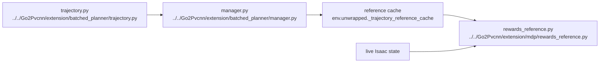

# AI Extension Trajectory Reward

## Navigation

- doc role: AI retrieval note for planner-based trajectory rewards
- paired human doc: [../human/human-11-extension-trajectory-reward.md](../human/human-11-extension-trajectory-reward.md)
- previous: [ai-10-extension-planner-runtime.md](ai-10-extension-planner-runtime.md)
- next: [ai-12-isaaclab-runtime-testing-reference.md](ai-12-isaaclab-runtime-testing-reference.md)
- master index: [../index.md](../index.md)
- raw index: [../../raw/kinematic_footsteps/notes/index.md](../../raw/kinematic_footsteps/notes/index.md)

## Reward Principle

planner outputs are reward-only and never direct policy observations

## Reward Graph

## Reference Targets

1. root pose
2. joint angles
3. foot positions in root frame
4. contact state
5. planned touchdown

## Current Source Of Reference

default source is now:

- `BatchedTrajectoryManager`
- `batched_generate_trajectory`
- `planner_result_to_reference_cache`

Reward code still reads `env.unwrapped._trajectory_reference_cache`.

## Planner / Reward Interface

Reward code does not call planner internals directly.

- planner produces `BatchedTrajectoryResult`
- boundary code converts it into `ReferenceTrajectoryCache`
- manager selects the current phase
- reward helpers compare live Isaac state against that frame

This keeps planner internals decoupled from reward implementation as long as the cache contract stays stable.

## Important Health Metrics

- `trajectory_tracking_score`
- `root_xy_error_mean`
- `joint_error_mean`
- `foot_pos_root_error_mean`
- `contact_match_rate`
- `touchdown_error_mean`
- `reference_valid_ratio`

## Deprecated Mainline Notes

Do not treat these as current architecture docs:

- `use_raw_reference_trajectory`
- `reference_replan_interval_s`
- raw process/thread pool EventTerm replanning
- `reference_trajectory_events.py` as the default runtime path
