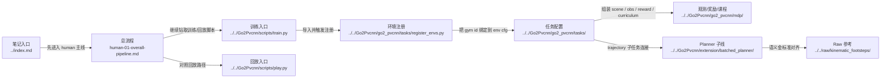

# Human Reading Guide

## 导航

- 文档类型：`human` 阅读入口
- 对应 AI 文档：[../ai/ai-00-reading-guide.md](../ai/ai-00-reading-guide.md)
- 上一篇：无
- 下一篇：[human-01-overall-pipeline.md](human-01-overall-pipeline.md)
- 总索引：[../index.md](../index.md)

## 这套笔记怎么读

这套笔记不是按 Python 文件逐个介绍，而是按当前仓库真正工作的主线来拆。

每一份流程文档都尽量固定回答四件事：

- 这一步为什么存在
- 这一步的输入是什么
- 这一步内部有哪些关键文件和模块
- 这一步输出给下一步什么

另外，这套 `notes/` 默认服务于仓库内相对路径浏览：

- 代码文件链接优先使用相对路径
- 不把服务器绝对路径写进文档
- 这样通过 `net use Z:` 挂到本地后的 Obsidian 索引也能直接复用

## Mermaid 代码入口图

## 推荐顺序

1. [human-01-overall-pipeline.md](human-01-overall-pipeline.md)
2. [human-02-training-and-entrypoints.md](human-02-training-and-entrypoints.md)
3. [human-03-environment-and-observations.md](human-03-environment-and-observations.md)
4. [human-04-lidar-and-pvcnn.md](human-04-lidar-and-pvcnn.md)
5. [human-05-ppo-and-runner.md](human-05-ppo-and-runner.md)
6. [human-06-assets-paths-and-experiments.md](human-06-assets-paths-and-experiments.md)
7. [human-07-manual-tuning-guide.md](human-07-manual-tuning-guide.md)
8. [human-08-extension-planner-reading-guide.md](human-08-extension-planner-reading-guide.md)

## 专题入口

如果你是为了自己手工调参，而不是先读流程，可以直接跳到：

- [human-07-manual-tuning-guide.md](human-07-manual-tuning-guide.md)

如果你是为了读 planner、做 `raw` 到 `extension` 对齐，直接跳到：

- [human-08-extension-planner-reading-guide.md](human-08-extension-planner-reading-guide.md)

## 你会看到的主链

`train/play/test scripts`
-> `task config`
-> `scene + sensors + observations`
-> `height_scanner / LiDAR / 可选 PVCNN features`
-> `PPO runner`
-> `checkpoints / assets / experiment outputs`

## 当前主线说明

- 当前默认训练主线是 `../../Go2Pvcnn/scripts/train.py` 里的 teacher 系列实验
- `../../Go2Pvcnn/scripts/play.py` 是对应回放主线
- `../../Go2Pvcnn/scripts/train_go2_pvcnn.py` 仍然存在，但更适合视为旧的 / 专项 PVCNN 训练路径，不应再默认当成整个仓库的主入口

## 本文与其他文档的关系

- 本文是整套 `human` 文档的入口，不负责解释单个阶段细节
- 读完本文，应该转到 [human-01-overall-pipeline.md](human-01-overall-pipeline.md) 看总流程
- 如果需要更适合机器检索的版本，对照看 [../ai/ai-00-reading-guide.md](../ai/ai-00-reading-guide.md)
