# Human Overall Pipeline

## 导航

- 文档类型：`human` 总流程总览
- 对应 AI 文档：[../ai/ai-01-overall-pipeline.md](../ai/ai-01-overall-pipeline.md)
- 上一篇：[human-00-reading-guide.md](human-00-reading-guide.md)
- 下一篇：[human-02-training-and-entrypoints.md](human-02-training-and-entrypoints.md)
- 总索引：[../index.md](../index.md)
- 相关代码：[README.md](../../Go2Pvcnn/README.md), [ARCHITECTURE.md](../../Go2Pvcnn/ARCHITECTURE.md), [train.py](../../Go2Pvcnn/scripts/train.py), [play.py](../../Go2Pvcnn/scripts/play.py), [train_go2_pvcnn.py](../../Go2Pvcnn/scripts/train_go2_pvcnn.py), [on_policy_runner.py](../../Go2Pvcnn/rsl_rl/rsl_rl/runners/on_policy_runner.py)

## 一句话总结

当前仓库的默认主线，是由 `train.py` / `play.py` 启动 teacher 系列实验，环境把机器人状态与 semantic / elevation / planner reference 相关观测整理出来，再交给 `rsl_rl_2_01` PPO runner 训练或回放。PVCNN 仍然保留，但它已经更像专门分支，而不是当前默认训练主线。

## Mermaid 总览图

```mermaid
graph LR
    train["训练/测试脚本\n../../Go2Pvcnn/scripts/train.py"]
    play["回放脚本\n../../Go2Pvcnn/scripts/play.py"]
    register["任务注册\n../../Go2Pvcnn/go2_pvcnn/tasks/register_envs.py"]
    envcfg["任务配置\n../../Go2Pvcnn/go2_pvcnn/tasks/*.py"]
    obs["观测/课程\n../../Go2Pvcnn/go2_pvcnn/mdp/observations.py\n../../Go2Pvcnn/go2_pvcnn/mdp/curriculums.py"]
    sensor["LiDAR / height_scanner\n../../Go2Pvcnn/go2_pvcnn/sensor/"]
    planner["planner cache / manager\n../../Go2Pvcnn/extension/batched_planner/manager.py"]
    pvcnn["PVCNN 专项分支\n../../Go2Pvcnn/go2_pvcnn/pvcnn_wrapper.py\n../../Go2Pvcnn/go2_pvcnn/wrapper/pvcnn_env_wrapper.py\n../../Go2Pvcnn/scripts/train_go2_pvcnn.py"]
    runner["PPO Runner\n../../Go2Pvcnn/rsl_rl/rsl_rl/runners/on_policy_runner.py"]
    outputs["日志/权重/资产\n../../logs\n../../assets\n../../other_model"]

    train -->|"选择 experiment -> env cfg"| register
    play -->|"选择 play env cfg"| register
    register -->|"gym id -> cfg class"| envcfg
    envcfg -->|"构建 scene / commands / rewards"| obs
    envcfg -->|"实例化 RayCaster / LiDAR"| sensor
    envcfg -->|"trajectory 实验挂 planner manager"| planner
    sensor -->|"点云/高程图输入"| obs
    planner -->|"reference cache / reward 读取"| obs
    obs -->|"拼接 policy / critic 观测"| runner
    pvcnn -.->|"旧 Go2PvcnnEnv / 专项训练链"| runner
    runner -->|"保存 checkpoint / metrics"| outputs
    outputs -->|"resume / play 时再读取"| train
```

## 大流程

### 阶段 1：入口脚本决定运行模式

入口通常来自 `Go2Pvcnn/scripts/`，例如训练、播放、碰撞测试和 LiDAR 测试脚本。

输出：

- 命令行参数
- 环境配置选择
- checkpoint / asset / log 路径

### 阶段 2：任务配置搭场景和 manager

`go2_pvcnn/tasks/` 下的环境配置类定义机器人、地形、传感器、奖励、终止条件以及训练/播放差异。

输出：

- scene cfg
- observation cfg
- reward cfg
- curriculum 开关和地形采样方式

### 阶段 3：观测链组织机器人状态与课程逻辑

`mdp/` 和相关配置决定命令采样、课程难度、观测拼接和部分运行期行为。

输出：

- policy 观测
- critic 观测
- curriculum 难度推进

### 阶段 4：height_scanner / LiDAR / planner cache 提供感知特征

当前 teacher 主线主要使用 semantic / elevation grid、height scanner，以及 `teacher_elevation_trajectory` 下的 planner-owned reference cache。PVCNN 相关点云特征链仍然存在，但主要在 `train_go2_pvcnn.py` 那条专项路径里使用。

输出：

- elevation / semantic maps
- reference trajectory cache
- 供 PPO 使用的 policy / critic 输入

### 阶段 5：PPO runner 驱动训练和回放主循环

当前主线通过 `rsl_rl_2_01.runners.OnPolicyRunner` 驱动 rollout、update、logging 与 checkpoint。可选的 PVCNN 同步训练更多属于旧 PVCNN 分支，而不是默认 teacher 路径。

输出：

- actor / critic 更新
- 训练日志
- checkpoint

### 阶段 6：资产、权重和实验结果沉淀到目录

模型权重、USD 资产、家具资源、日志和实验截图共同组成可复现实验上下文。

输出：

- `logs/`
- `assets/`
- `other_model/`
- `furniture_test_images/`

## 关键关系

- `Go2Pvcnn/` 是当前项目主实现
- `raw/` 和 `onlyReference/` 是参考资料，不应误判为当前主线
- `notes/` 负责把真实主线沉淀成可被人和 agent 复用的知识索引

## M1 当前主线

当前 M1 60 mm 固定前障碍 accepted 主线是分层控制：PVCNN 与 actor 输出 wave gate，
顺序 task-space 控制器执行 FAR/RAR 的主动抬升、横杆上方无接触净空和姿态恢复；非 wave
区腿部动作严格锁零，四轮实际速度由闭环均衡器同步。入口为
`Go2Pvcnn/scripts/run_m1_contactfree_policy_train.sh` 与
`Go2Pvcnn/scripts/run_m1_contactfree_policy_play.sh`。

M1 先通过 `Isaac-M1-Roll-v0` 和 `Isaac-M1-Wave-Flat-v0` 获得稳定轮式运动，再进入
`Isaac-M1-Pvcnn-Flat-Small-Avoidance-v0`。该 Stage 2B task 继承原 Go2Pvcnn 的平地小障碍
terrain、语义课程和 16x16 双通道扫描，只替换 M1 USD、body selector 与 12+4 混合动作。
Go2 专用 batch MPC IK 当前保持关闭，直到 M1 连杆运动学和关节限制完成独立适配。
M1 的四个轮子由单一策略速度控制，底层 PI 同步器根据实际关节速度补偿不同轴载荷；训练奖励约束
实际轮速差，而不是强制四个补偿后的内部驱动目标数值相同。

## 本文与其他文档的关系

- 本文把 `02-06` 五个阶段放到一条总链里
- 如果要读第一个真实阶段，继续看 [human-02-training-and-entrypoints.md](human-02-training-and-entrypoints.md)
- 如果要看更适合检索的版本，对照看 [../ai/ai-01-overall-pipeline.md](../ai/ai-01-overall-pipeline.md)
