# Human Training And Entrypoints

## 导航

- 文档类型：`human` 阶段文档
- 对应 AI 文档：[../ai/ai-02-training-and-entrypoints.md](../ai/ai-02-training-and-entrypoints.md)
- 上一篇：[human-01-overall-pipeline.md](human-01-overall-pipeline.md)
- 下一篇：[human-03-environment-and-observations.md](human-03-environment-and-observations.md)
- 总索引：[../index.md](../index.md)

## 作用

说明当前仓库有哪些主要入口脚本，并区分哪些是当前默认主线，哪些是旧的 / 专项分支。

## Mermaid 代码入口图

```mermaid
graph LR
    train["训练脚本\n../../Go2Pvcnn/scripts/train.py"]
    play["回放脚本\n../../Go2Pvcnn/scripts/play.py"]
    collision["碰撞测试\n../../Go2Pvcnn/scripts/test_go2_pvcnn_collision.py"]
    legacy["旧 PVCNN 训练\n../../Go2Pvcnn/scripts/train_go2_pvcnn.py"]
    launcher["Isaac AppLauncher\nisaaclab.app.AppLauncher"]
    register["环境注册\n../../Go2Pvcnn/go2_pvcnn/tasks/register_envs.py"]
    envcfg["环境配置类\n../../Go2Pvcnn/go2_pvcnn/tasks/*.py"]
    gymenv["Gym / ManagerBasedRLEnv\nisaaclab.envs"]
    wrapper["RSL-RL wrapper\ntrain.py::SimpleRslRlEnvWrapper"]
    runner["OnPolicyRunner\n../../Go2Pvcnn/rsl_rl/rsl_rl/runners/on_policy_runner.py"]
    logs["日志与 checkpoint\n../../logs/rsl_rl/"]

    train -->|"解析 CLI 并启动 simulator"| launcher
    play -->|"解析 CLI 并启动 simulator"| launcher
    collision -->|"独立测试入口"| launcher
    legacy -->|"旧专项训练入口"| launcher
    train -->|"import 触发注册"| register
    play -->|"import 触发注册"| register
    legacy -->|"旧 Go2PvcnnEnv 路径"| register
    register -->|"experiment -> gym id / cfg class"| envcfg
    envcfg -->|"gym.make 创建 env"| gymenv
    gymenv -->|"训练脚本内包装成 VecEnv"| wrapper
    wrapper -->|"runner.learn / runner.load"| runner
    runner -->|"写出训练产物"| logs
    logs -->|"resume / play 再读取 checkpoint"| play
```



## 重点入口

- [train.py](../../Go2Pvcnn/scripts/train.py)
- [train_go2_pvcnn.py](../../Go2Pvcnn/scripts/train_go2_pvcnn.py)
- [play.py](../../Go2Pvcnn/scripts/play.py)
- [test_go2_pvcnn_collision.py](../../Go2Pvcnn/scripts/test_go2_pvcnn_collision.py)
- [m1_train.py](../../Go2Pvcnn/scripts/m1_train.py)
- [m1_play.py](../../Go2Pvcnn/scripts/m1_play.py)

## M1 当前长期训练主线

M1 已按课程顺序先完成可自主滚动的低维 locomotion 底座，再完成 60 mm 小障碍策略和官方 PVCNN 感知链。Stage 1 与 Stage 2 的 accepted 产物彼此独立，后续训练不覆盖验收版本。

### 环境激活

普通 M1 训练和播放只需激活现有环境：

```bash
cd /home/xk/coding/M1
source /home/xk/miniconda3/etc/profile.d/conda.sh
conda activate go2pvcnn_ablation
```

官方 PVCNN 入口会在导入 Torch 扩展前自动发现
`/home/xk/coding/M1/.cuda-nvcc-12.8`，正常使用不需要手动设置 `CUDA_HOME`。
该目录是独立 CUDA 开发工具链，不修改 `go2pvcnn_ablation`。只有自动发现失败时才需要按下面方式排障：

```bash
export CUDA_HOME=/home/xk/coding/M1/.cuda-nvcc-12.8
export PATH=$CUDA_HOME/bin:$PATH
export CUDACXX=$CUDA_HOME/bin/nvcc
export CPATH=$CUDA_HOME/targets/x86_64-linux/include${CPATH:+:$CPATH}
export LIBRARY_PATH=$CUDA_HOME/targets/x86_64-linux/lib${LIBRARY_PATH:+:$LIBRARY_PATH}
export LD_LIBRARY_PATH=$CUDA_HOME/targets/x86_64-linux/lib:$CUDA_HOME/lib${LD_LIBRARY_PATH:+:$LD_LIBRARY_PATH}
export TORCH_CUDA_ARCH_LIST=12.0
```

### 当前 accepted：PVCNN gate + 无接触逐轮跨越

- 播放环境：`Isaac-M1-Pvcnn-Crossing-60mm-Policy-Play-v0`
- 训练环境：`Isaac-M1-Pvcnn-Crossing-60mm-ContactFree-Train-v0`
- 动作契约：`12 leg position + 4 wheel velocity`
- 非 wave：12 个腿动作严格归零，保持默认滑行姿态
- wave：PVCNN + actor 判断触发时机，低层顺序控制仅释放右侧 FAR、RAR 跨杆阶段
- 四轮：同向前进并按实际关节速度闭环均衡，验收最大均速差必须不超过 `0.08 rad/s`
- 成功：必须 FAR/RAR 在横杆上方达到净空且接触力低于门限；碾压或横杆接触不计成功
- accepted policy：`Go2Pvcnn/logs/m1_curriculum/stage2e_contactfree_policy_gate/m1_contactfree_policy_accepted.pt`
- accepted perception：`Go2Pvcnn/logs/m1_curriculum/stage2e_contactfree_policy_gate/m1_contactfree_perception_accepted.pt`

一键播放：

```bash
bash Go2Pvcnn/scripts/run_m1_contactfree_policy_play.sh
```

一键继续训练：

```bash
bash Go2Pvcnn/scripts/run_m1_contactfree_policy_train.sh
```

严格验收：

```bash
python Go2Pvcnn/scripts/m1_checkpoint_eval.py \
  --task Isaac-M1-Pvcnn-Crossing-60mm-Policy-Play-v0 \
  --checkpoint Go2Pvcnn/logs/m1_curriculum/stage2e_contactfree_policy_gate/m1_contactfree_policy_accepted.pt \
  --perception-checkpoint Go2Pvcnn/logs/m1_curriculum/stage2e_contactfree_policy_gate/m1_contactfree_perception_accepted.pt \
  --num_envs 8 --steps 1600 --clip-actions 1.0 \
  --semantic-crossing --min-crossing-rate 1.0 \
  --disable-crossing-reset --obstacle-threshold 1.50 \
  --report Go2Pvcnn/logs/m1_curriculum/stage2e_contactfree_policy_gate/recheck.json \
  --headless
```

accepted 候选连续三次 8 环境严格复现均通过：每次 8/8 到达 phase 11，FAR/RAR
主动净空全部通过，横杆碰撞全部为 false，base height 恢复通过。三次最大倾角为
`0.280~0.288 rad`，四轮实际均速最大差为 `0.068~0.073 rad/s`。

### Stage 1：四轮同速正向稳定滚动

- 环境：`Isaac-M1-Roll-v0`
- 行为：12 个腿部 position action 锁定在默认站姿，4 个 wheel velocity action 由 wrapper 约束为同速
- 已确认方向：圆柱轮碰撞体下，正轮速对应机器人 `+X` 前进；wrapper 基准动作是 `+0.40`
- 已验收模型：`Go2Pvcnn/logs/m1_curriculum/stage1_roll_cylinder_long/accepted.pt`
- 验收报告：`Go2Pvcnn/logs/m1_curriculum/stage1_roll_cylinder_long/accepted_report.json`
- 目的：先让 M1 在平地上稳定自己往前动，避免一开始就因为轮速过大翻倒或擦地

训练：

```bash
python Go2Pvcnn/scripts/m1_train.py \
  --task Isaac-M1-Roll-v0 \
  --num_envs 64 --max_iterations 500 \
  --run_name m1_roll_cylinder_long500 \
  --clip-actions 1.0 --headless
```

回放：

```bash
python Go2Pvcnn/scripts/m1_play.py \
  --task Isaac-M1-Roll-v0 \
  --checkpoint Go2Pvcnn/logs/m1_curriculum/stage1_roll_cylinder_long/accepted.pt \
  --num_envs 1 \
  --steps 100000 \
  --clip-actions 1.0
```

20 环境、30 秒独立验收为 20/20 timeout，平均 `x=+1.230 m`；四轮平均实际速度为
`0.456/0.452/0.408/0.403 rad/s`，最大差 `0.0525 rad/s`，四轮接地率均为 `99.93%`。
Roll wrapper 的 PI 与负载均衡补偿用于保持四轮实际速度同步，门控阈值为 `0.08 rad/s`。

### Stage 2A：平地 wave 腿轮协同

- 环境：`Isaac-M1-Wave-Flat-v0`
- 已验收模型：`Go2Pvcnn/logs/m1_curriculum/stage2a_wave_flat/accepted_cylinder.pt`
- 行为：四轮保持同向等速，释放有界的 12 腿部 wave residual

### Stage 2B：原 Go2Pvcnn 小障碍环境

- 训练环境：`Isaac-M1-Pvcnn-Flat-Small-Avoidance-v0`
- 播放环境：`Isaac-M1-Pvcnn-Flat-Small-Avoidance-Play-v0`
- 地形、语义障碍生成、10 级密度课程和 16x16 elevation/semantic scan 复用原项目实现
- 动作保持 `12 leg position + 4 wheel velocity`
- policy 输入为 60 维本体状态加 512 维双通道语义图，共 572 维
- 四轮共享一个策略基准速度；wrapper 使用受限 PI 控制补偿前后轴负载差，使四轮实际角速度保持一致
- 四轮滑行验收：四轮平均实际速度最大差不超过 `0.08`，每个轮子的接地率不低于 `95%`
- 已验收四轮同步基线：`Go2Pvcnn/logs/m1_curriculum/stage2b_original_small_env/accepted_sync_slide_model1300.pt`；30 秒实测最大轮速差 `0.0133`，四轮接地率均高于 `99.8%`
- 原语义小障碍尺寸为直径 `0.12 m`、高度 `0.16 m`；稳定四轮滑行只是 Stage 2B 底座，后续课程还需学习 wave 抬腿跨越
- 原 Go2 MPC teacher 暂不启用，因为它的 IK 连杆长度和关节限制是 Go2 参数；后续完成 M1 MPC 运动学适配后再开启

生成 Stage 2B 初始化权重：

```bash
python Go2Pvcnn/scripts/m1_prepare_wave_checkpoint.py \
  Go2Pvcnn/logs/m1_curriculum/stage2a_wave_flat/accepted_cylinder.pt \
  Go2Pvcnn/logs/m1_curriculum/stage2b_original_small_env/stage2a_expanded572.pt \
  --observation-dim 572 --preserve-leg-outputs
```

训练：

```bash
python Go2Pvcnn/scripts/m1_train.py \
  --task Isaac-M1-Pvcnn-Flat-Small-Avoidance-v0 \
  --num_envs 64 --max_iterations 3000 \
  --run_name m1_pvcnn_original_small_stage2b_syncfix2 \
  --load_checkpoint Go2Pvcnn/logs/m1_curriculum/stage2b_original_small_env/stage2a_expanded572.pt \
  --reset-optimizer --clip-actions 1.0 --headless
```

回放：

```bash
python Go2Pvcnn/scripts/m1_play.py \
  --task Isaac-M1-Pvcnn-Flat-Small-Avoidance-Play-v0 \
  --checkpoint Go2Pvcnn/logs/m1_curriculum/stage2b_original_small_env/accepted_sync_slide_model1300.pt \
  --lock-legs --rolling-wheel-velocity 0.50 \
  --num_envs 1 --steps 100000 --clip-actions 1.0
```

`--rolling-wheel-velocity` 对开环和 checkpoint 回放都生效。`0.50` 的 8 环境、30 秒锁腿验收中，
四轮平均实际角速度为 `0.543/0.511/0.517/0.531 rad/s`，最大均值差 `0.0324 rad/s`，
四轮接地率均高于 `99.8%`，8/8 环境跑满且无姿态终止。需要更保守的滑行时使用 `0.40`；
暂不建议超过 `0.55`，直到更高速档位完成同样的长时门控。

`Isaac-M1-Small-Obstacle-v0` 及 5/10 mm 版本仅保留为固定方条诊断环境，不再作为长期 Stage 2 训练主线。

### Stage 2C：60 mm 小障碍跨越与姿态恢复

- 环境：`Isaac-M1-Pvcnn-Crossing-60mm-v0`
- 动作：`12 leg position + 4 wheel velocity`
- 感知：复用 Stage 2B 的 572 维本体状态与 16x16 elevation/semantic scan
- 平地目标：机身高度 `0.55 m`；障碍区放松高度约束，`x > 0.70 m` 后恢复默认腿部姿态
- 障碍区轮速目标：前轮 `0.20`、后轮 `0.95`；这个差值用于抵消前后轴负载差，目标是四轮实际速度一致
- 成功线：`x > 1.10 m`，确保越障后有恢复路段再 reset
- 当前验收模型：`Go2Pvcnn/logs/m1_curriculum/stage2c_semantic_crossing/m1_crossing60_balanced_height_accepted.pt`
- 验收报告：`Go2Pvcnn/logs/m1_curriculum/stage2c_semantic_crossing/m1_crossing60_balanced_height_accepted_report.json`

从当前 accepted checkpoint 继续训练：

```bash
python Go2Pvcnn/scripts/m1_train.py \
  --task Isaac-M1-Pvcnn-Crossing-60mm-v0 \
  --num_envs 64 --max_iterations 1600 \
  --run_name m1_pvcnn_crossing60_v12_balanced_wheels_height \
  --load_checkpoint Go2Pvcnn/logs/m1_curriculum/stage2c_semantic_crossing/m1_crossing60_balanced_height_accepted.pt \
  --reset-optimizer --clip-actions 1.0 --headless
```

回放：

```bash
python Go2Pvcnn/scripts/m1_play.py \
  --task Isaac-M1-Pvcnn-Crossing-60mm-v0 \
  --checkpoint Go2Pvcnn/logs/m1_curriculum/stage2c_semantic_crossing/m1_crossing60_balanced_height_accepted.pt \
  --num_envs 1 --steps 100000 --clip-actions 1.0
```

独立验收：

```bash
python Go2Pvcnn/scripts/m1_checkpoint_eval.py \
  --task Isaac-M1-Pvcnn-Crossing-60mm-v0 \
  --checkpoint Go2Pvcnn/logs/m1_curriculum/stage2c_semantic_crossing/m1_crossing60_balanced_height_accepted.pt \
  --num_envs 8 --steps 2500 --clip-actions 1.0 \
  --semantic-crossing --min-crossing-rate 0.75 \
  --report Go2Pvcnn/logs/m1_curriculum/stage2c_semantic_crossing/recheck.json \
  --headless
```

`model_1500.pt` 的 8 环境确定性验收为 8/8 语义跨越、8/8 高度恢复、无 bad orientation；
四轮平均实际速度为 `0.489/0.492/0.491/0.485 rad/s`，最大差 `0.0072 rad/s`，
四轮接地率均高于 `99.64%`，最大倾角 `0.0161 rad`。

### Stage 2D：官方 PVCNN 感知与联合训练

- 官方源码：`/home/xk/coding/M1/pvcnn`
- 输入：16x16 elevation grid 转成 256 点 XYZ point cloud
- PVCNN 输出：3 类逐点语义；actor 使用 PVCNN 预测，critic 在训练时保留 scanner 真值
- actor/critic 观测仍为 572 维，兼容 Stage 2C locomotion checkpoint
- accepted joint policy：`Go2Pvcnn/logs/m1_curriculum/stage2c_semantic_crossing/m1_pvcnn_joint_accepted.pt`
- accepted perception：`Go2Pvcnn/logs/m1_curriculum/stage2c_semantic_crossing/m1_pvcnn_perception_accepted.pt`
- 验收报告：`Go2Pvcnn/logs/m1_curriculum/stage2c_semantic_crossing/m1_pvcnn_joint_accepted_report.json`

监督预训练 PVCNN：

```bash
python Go2Pvcnn/scripts/m1_pvcnn_pretrain.py \
  --task Isaac-M1-Pvcnn-Crossing-60mm-v0 \
  --policy-checkpoint Go2Pvcnn/logs/m1_curriculum/stage2c_semantic_crossing/m1_crossing60_balanced_height_accepted.pt \
  --output Go2Pvcnn/checkpoints/pvcnn/m1_semantic_60mm.pt \
  --num-envs 32 --steps 500 --eval-steps 50 \
  --seed 20260713 --clip-actions 1.0 --headless
```

该入口只有在独立评估达到 `semantic_accuracy >= 0.97` 且 `obstacle_recall >= 0.85` 时才返回成功。当前预训练模型为 `0.997375 / 0.903188`。

联合训练 PPO 与 PVCNN：

```bash
python Go2Pvcnn/scripts/m1_pvcnn_train.py \
  --task Isaac-M1-Pvcnn-Crossing-60mm-v0 \
  --policy-checkpoint Go2Pvcnn/logs/m1_curriculum/stage2c_semantic_crossing/m1_crossing60_balanced_height_accepted.pt \
  --perception-checkpoint Go2Pvcnn/checkpoints/pvcnn/m1_semantic_60mm.pt \
  --num-envs 32 --max-iterations 1000 \
  --run-name m1_pvcnn_joint_long \
  --pvcnn-train-interval 10 --pvcnn-train-epochs 1 \
  --clip-actions 1.0 --headless
```

播放 accepted PVCNN 策略：

```bash
python Go2Pvcnn/scripts/m1_play.py \
  --task Isaac-M1-Pvcnn-Crossing-60mm-v0 \
  --checkpoint Go2Pvcnn/logs/m1_curriculum/stage2c_semantic_crossing/m1_pvcnn_joint_accepted.pt \
  --perception-checkpoint Go2Pvcnn/logs/m1_curriculum/stage2c_semantic_crossing/m1_pvcnn_perception_accepted.pt \
  --rolling-wheel-velocity 1.0 \
  --num_envs 1 --steps 100000 --clip-actions 1.0
```

`1.0` 加速档的独立 8 环境验收报告为
`Go2Pvcnn/logs/m1_curriculum/stage2c_semantic_crossing/m1_pvcnn_speed100_eval.json`：
8/8 越障并恢复高度，四轮实际均速最大差 `0.0243 rad/s`，接地率最低 `99.59%`，
最大倾角 `0.0162 rad`。

自动验收 accepted PVCNN 策略：

```bash
python Go2Pvcnn/scripts/m1_checkpoint_eval.py \
  --task Isaac-M1-Pvcnn-Crossing-60mm-v0 \
  --checkpoint Go2Pvcnn/logs/m1_curriculum/stage2c_semantic_crossing/m1_pvcnn_joint_accepted.pt \
  --perception-checkpoint Go2Pvcnn/logs/m1_curriculum/stage2c_semantic_crossing/m1_pvcnn_perception_accepted.pt \
  --num_envs 8 --steps 2500 --clip-actions 1.0 \
  --semantic-crossing --min-crossing-rate 0.75 \
  --report Go2Pvcnn/logs/m1_curriculum/stage2c_semantic_crossing/pvcnn_recheck.json \
  --headless
```

当前 joint accepted 的固定种子验收为 8/8 越障和高度恢复、无 bad orientation；四轮平均实际速度为 `0.488/0.492/0.490/0.486 rad/s`，最大差 `0.00591 rad/s`，四轮接地率最低 `99.57%`，最大倾角 `0.01413 rad`。

### Stage 2E：非 wave 锁定姿态、wave 自主越障

- 训练教师环境：`Isaac-M1-Pvcnn-Crossing-60mm-Guided-Fixed-v0`
- 最终播放环境：`Isaac-M1-Pvcnn-Crossing-60mm-Distilled-Play-v0`
- 动作仍为 `12 leg position + 4 wheel velocity`；腿动作项本身不设 clip
- 非 wave 区间把 12 个腿部增量严格置零，因此前腿、后腿分别保持 USD 默认站姿和基准高度
- wave 区间放开全部 12 个腿部动作，由蒸馏后的策略输出抬腿动作，播放时不再叠加教师参考
- 地形为 1x1 固定场景，机器人正前方 `(x=0.65 m, y=0)` 放置尺寸为 `0.06 x 0.60 x 0.06 m` 的真实立方体横杆
- 固定课程验收以底座越过 `x=1.50 m` 为成功，确保越障后包含足够的姿态恢复路段
- accepted policy：`Go2Pvcnn/logs/m1_curriculum/stage2d_unlocked_wave/m1_pvcnn_crossing60_accepted_v2.pt`
- accepted perception：`Go2Pvcnn/logs/m1_curriculum/stage2d_unlocked_wave/m1_pvcnn_distilled_perception_accepted.pt`
- 验收报告：`Go2Pvcnn/logs/m1_curriculum/stage2d_unlocked_wave/m1_pvcnn_crossing60_accepted_v2_report.json`

继续进行 wave 教师蒸馏训练：

```bash
python Go2Pvcnn/scripts/m1_wave_distill.py \
  --task Isaac-M1-Pvcnn-Crossing-60mm-Guided-Fixed-v0 \
  --policy-checkpoint Go2Pvcnn/logs/m1_curriculum/stage2d_unlocked_wave/m1_constant_wave_bootstrap.pt \
  --perception-checkpoint Go2Pvcnn/logs/m1_curriculum/stage2d_unlocked_wave/m1_pvcnn_distilled_perception_accepted.pt \
  --num-envs 32 --updates 500 --learning-rate 1e-4 \
  --checkpoint-interval 250 --student-rollout-final-weight 0.50 \
  --smoothness-weight 0.0 --overshoot-weight 0.10 --overshoot-margin 0.10 \
  --run-name m1_wave_dagger_active_v3 \
  --clip-actions 1.0 --headless
```

该 DAgger 蒸馏入口只在 active wave 样本上更新 actor 最后一层的 12 个腿部输出；四个轮子输出不被训练改写。非 wave 的零腿动作由环境包装器负责，教师只生成训练目标，accepted 播放任务关闭教师动作。

一键播放：

```bash
bash Go2Pvcnn/scripts/run_m1_front_obstacle_play.sh
```

等价的完整播放命令：

```bash
python Go2Pvcnn/scripts/m1_play.py \
  --task Isaac-M1-Pvcnn-Crossing-60mm-Distilled-Play-v0 \
  --checkpoint Go2Pvcnn/logs/m1_curriculum/stage2d_unlocked_wave/m1_pvcnn_crossing60_accepted_v2.pt \
  --perception-checkpoint Go2Pvcnn/logs/m1_curriculum/stage2d_unlocked_wave/m1_pvcnn_distilled_perception_accepted.pt \
  --rolling-wheel-velocity 1.0 \
  --num_envs 1 --steps 100000 --clip-actions 1.0
```

重新执行固定课程验收：

```bash
python Go2Pvcnn/scripts/m1_checkpoint_eval.py \
  --task Isaac-M1-Pvcnn-Crossing-60mm-Distilled-Play-v0 \
  --checkpoint Go2Pvcnn/logs/m1_curriculum/stage2d_unlocked_wave/m1_pvcnn_crossing60_accepted_v2.pt \
  --perception-checkpoint Go2Pvcnn/logs/m1_curriculum/stage2d_unlocked_wave/m1_pvcnn_distilled_perception_accepted.pt \
  --num_envs 8 --steps 1600 --clip-actions 1.0 --wheel-action 1.0 \
  --semantic-crossing --min-crossing-rate 1.0 \
  --disable-crossing-reset --obstacle-threshold 1.50 \
  --report Go2Pvcnn/logs/m1_curriculum/stage2d_unlocked_wave/m1_pvcnn_crossing60_accepted_v2_recheck.json \
  --headless
```

最新固定种子复验结果为 8/8 越障、8/8 语义越障、0 次姿态终止；最大倾角为 `0.35047 rad`，非 wave 腿动作最大值为 `0.0`，前后轮抬升检测均通过，越障后恢复基准高度。四轮实际均速为 `2.8780/2.8800/2.8482/2.8349 rad/s`，最大差为 `0.04508 rad/s`。
障碍区前后轮目标分别使用 `6.4/8.0`，用于补偿 M1 前后轴的负载和机构差异；包装器继续根据四轮实际速度误差做同步修正，并加入有限的横向/偏航修正。验收关注四轮实际速度一致，而不是四个目标命令数值相同。当前 accepted 范围是固定正前方 60 mm 小障碍，多地形泛化仍作为下一阶段训练目标。

## 当前推荐理解方式

- M1 平地与原始语义图策略使用 `m1_train.py` / `m1_play.py`
- M1 官方 PVCNN 使用 `m1_pvcnn_pretrain.py` / `m1_pvcnn_train.py`，并仍由 `m1_play.py --perception-checkpoint` 回放
- M1 非 wave 固定站姿、wave 自主越障使用 `m1_wave_distill.py` 训练，并用 `Isaac-M1-Pvcnn-Crossing-60mm-Distilled-Play-v0` 回放
- `m1_checkpoint_eval.py` 是 Stage 1、Stage 2C 和 PVCNN accepted 提升前的统一门控入口
- `train.py` / `play.py` 保留给原 Go2 teacher 系列，不是 M1 当前主入口
- 旧 `train_go2_pvcnn.py` 不再作为 M1 可复现链的一部分

## 上游输入

- 命令行参数
- 本地环境变量
- checkpoint 路径
- 任务配置类

## 下游消费者

- `go2_pvcnn/tasks/` 环境配置
- `M1RslRlEnvWrapper` / `M1PvcnnRslRlEnvWrapper`
- `rsl_rl_2_01` runner

## 已确认的关键点

- M1 动作始终为 `12 leg position + 4 wheel velocity`
- PVCNN actor 使用预测语义，训练 critic 使用 scanner 真值
- joint checkpoint 同时保存 PPO 与 PVCNN 权重；`pvcnn_final.pt` 保存可独立加载的结构元数据和感知权重
- accepted 只在固定种子的多环境门控通过后更新
