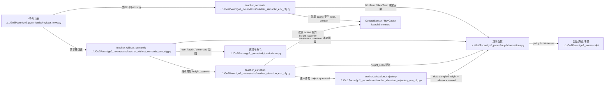

# Human Environment And Observations

## 导航

- 文档类型：`human` 阶段文档
- 对应 AI 文档：[../ai/ai-03-environment-and-observations.md](../ai/ai-03-environment-and-observations.md)
- 上一篇：[human-02-training-and-entrypoints.md](human-02-training-and-entrypoints.md)
- 下一篇：[human-04-lidar-and-pvcnn.md](human-04-lidar-and-pvcnn.md)
- 总索引：[../index.md](../index.md)

## 作用

说明任务配置、场景、奖励、观测和 curriculum 是怎么拼起来的。

## Mermaid 代码结构图

## 重点目录

- [tasks](../../Go2Pvcnn/go2_pvcnn/tasks)
- [curriculums.py](../../Go2Pvcnn/go2_pvcnn/mdp/curriculums.py)

## 上游输入

- 入口脚本选择的 env cfg
- 机器人模型、地形、传感器配置

## 下游消费者

- LiDAR / ray caster
- PVCNN 特征抽取
- PPO runner 的观测输入

## 待补充

- policy / critic 观测各自包含什么
- curriculum 在哪些 env cfg 中启用
- PLAY 和训练版配置的真实差异
