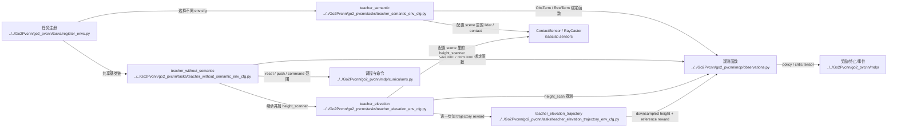

# Human Environment And Observations

## 导航

- 文档类型：`human` 阶段文档
- 对应 AI 文档：[../ai/ai-03-environment-and-observations.md](../ai/ai-03-environment-and-observations.md)
- 上一篇：[human-02-training-and-entrypoints.md](human-02-training-and-entrypoints.md)
- 下一篇：[human-04-lidar-and-pvcnn.md](human-04-lidar-and-pvcnn.md)
- 总索引：[../index.md](../index.md)

## 作用

说明任务配置、场景、奖励、观测和 curriculum 是怎么拼起来的。

## Mermaid 代码结构图

## 重点目录

- [tasks](../../Go2Pvcnn/go2_pvcnn/tasks)
- [curriculums.py](../../Go2Pvcnn/go2_pvcnn/mdp/curriculums.py)

## 上游输入

- 入口脚本选择的 env cfg
- 机器人模型、地形、传感器配置

## 下游消费者

- LiDAR / ray caster
- PVCNN 特征抽取
- PPO runner 的观测输入

## 待补充

- policy / critic 观测各自包含什么
- curriculum 在哪些 env cfg 中启用
- PLAY 和训练版配置的真实差异

## M1 + Panda 折叠负载基础运动

- 新任务 ID 是 `Isaac-M1-Panda-Folded-Load-v0`，与之前失败的 coordinated 长训路线隔离。
- 接口仍是 103 维观测、23 维动作和 200 Hz；动作顺序保持 12 腿 + 4 轮 + 7 Panda，但当前只允许前 16 维参与策略。
- Panda 仍是具有质量、惯量、重力和关节反作用的动态部件，使用既有折叠姿态与隐式 PD，不是固定视觉负载。
- 原 base target / EE error 观测槽保留为有限零兼容位；desired twist 槽承载每个 episode 固定的前进/后退/转向命令。
- 奖励只学习速度跟踪、平衡、侧滑、前 16 维动作变化和力矩；不学习旧 base 位置、EE 或折叠臂目标，也没有外力事件。
- wrapper 已在环境 step 前严格清零 Panda 动作并写入 fold position/零速度 target；folded-load 任务独立使用 shoulder `120/8`，全局资产仍为 `80/4`。GPU0 256 步在 `87 Nm` 饱和下未通过 joint-margin gate，详见 [PD retune GPU 日志](../log/2026-08-25-m1-panda-folded-load-pd-retune-gpu.md)。
