# Human LiDAR And PVCNN

## 导航

- 文档类型：`human` 阶段文档
- 对应 AI 文档：[../ai/ai-04-lidar-and-pvcnn.md](../ai/ai-04-lidar-and-pvcnn.md)
- 上一篇：[human-03-environment-and-observations.md](human-03-environment-and-observations.md)
- 下一篇：[human-05-ppo-and-runner.md](human-05-ppo-and-runner.md)
- 总索引：[../index.md](../index.md)

## 作用

说明当前仓库里“感知链”其实分成两条：默认 teacher 主线主要消费 semantic / elevation / height scanner 观测；旧的专项 PVCNN 主线才会把点云继续送进 PVCNN。

## Mermaid 数据流图

```mermaid
graph LR
    envcfg["任务配置\n../../Go2Pvcnn/go2_pvcnn/tasks/go2_pvcnn_env_cfg.py\n../../Go2Pvcnn/go2_pvcnn/tasks/teacher_semantic_env_cfg.py"]
    lidar["语义 LiDAR / RayCaster\n../../Go2Pvcnn/go2_pvcnn/sensor/lidar/\n../../Go2Pvcnn/go2_pvcnn/sensor/semantic_raycaster/"]
    rawpc["点云 / 语义标签\nsensor.data.pointcloud\nsensor.data.semantic_labels"]
    obs["观测函数\n../../Go2Pvcnn/go2_pvcnn/mdp/observations.py\n../../Go2Pvcnn/extension/mdp/observations.py"]
    costmap["代价地图生成\n../../Go2Pvcnn/go2_pvcnn/mdp/cost_map.py"]
    wrapper["PVCNN 包装器\n../../Go2Pvcnn/go2_pvcnn/pvcnn_wrapper.py"]
    envwrapper["环境 wrapper\n../../Go2Pvcnn/go2_pvcnn/wrapper/pvcnn_env_wrapper.py"]
    planner["trajectory 高分辨率 height_scanner\n../../Go2Pvcnn/go2_pvcnn/tasks/teacher_elevation_trajectory_env_cfg.py"]
    policy["policy / critic 输入\nRSL-RL runner"]

    envcfg -->|"实例化传感器配置"| lidar
    lidar -->|"输出 yaw-aligned pointcloud"| rawpc
    rawpc -->|"observations.py 清洗/采样"| obs
    planner -->|"downsampled height scan / reference 相关观测"| obs
    obs -->|"height map + semantic -> cost map"| costmap
    costmap -->|"双通道地图 / 特征拼接"| policy
    obs -->|"policy / critic observation tensor"| policy
    envwrapper -.->|"旧 PVCNN 专项路径下注入 pvcnn_wrapper"| obs
    obs -.->|"旧路径才调用 extract_features"| wrapper
    wrapper -.->|"返回逐点或全局特征"| obs
```

## 重点目录

- [sensor/lidar](../../Go2Pvcnn/go2_pvcnn/sensor/lidar)
- [pvcnn_wrapper.py](../../Go2Pvcnn/go2_pvcnn/pvcnn_wrapper.py)
- [wrapper/pvcnn_env_wrapper.py](../../Go2Pvcnn/go2_pvcnn/wrapper/pvcnn_env_wrapper.py)

## 上游输入

- 场景中的 LiDAR / ray caster 配置
- 点云采样结果
- trajectory 实验里的高分辨率 `height_scanner`

## 下游消费者

- 观测项
- PPO policy / critic
- 旧路径下的 PVCNN 特征抽取 / 同步训练

## 待补充

## 已确认的现实边界

- `teacher_semantic` / `teacher_elevation` / `teacher_elevation_trajectory` 这条主线不需要把所有观测都送进 PVCNN
- `train_go2_pvcnn.py` 才是 PVCNN wrapper 真正在线上的主要入口
- 所以这篇文档现在更适合理解“感知分叉点”，而不是把 PVCNN 当成所有训练的必经阶段
