# Human PPO And Runner

## 导航

- 文档类型：`human` 阶段文档
- 对应 AI 文档：[../ai/ai-05-ppo-and-runner.md](../ai/ai-05-ppo-and-runner.md)
- 上一篇：[human-04-lidar-and-pvcnn.md](human-04-lidar-and-pvcnn.md)
- 下一篇：[human-06-assets-paths-and-experiments.md](human-06-assets-paths-and-experiments.md)
- 总索引：[../index.md](../index.md)

## 作用

说明 runner、PPO 和 rollout / update / checkpoint 主循环怎样和当前项目耦合，并明确区分“当前 teacher 主线”和“旧 PVCNN 分支”。

## Mermaid 训练主循环图

```mermaid
graph LR
    train["训练入口\n../../Go2Pvcnn/scripts/train.py"]
    wrapper["SimpleRslRlEnvWrapper\n../../Go2Pvcnn/scripts/train.py"]
    runner["OnPolicyRunner 源码\n../../Go2Pvcnn/rsl_rl/rsl_rl/runners/on_policy_runner.py"]
    storage["RolloutStorage\n../../Go2Pvcnn/rsl_rl/rsl_rl/storage/rollout_storage.py"]
    algo["PPO\n../../Go2Pvcnn/rsl_rl/rsl_rl/algorithms/ppo.py"]
    env["ManagerBasedRLEnv\nIsaac Lab"]
    obs["观测组\npolicy / critic"]
    ckpt["checkpoint / train_cfg / env_cfg\n../../logs/rsl_rl/"]

    train -->|"创建 env 后包成 VecEnv"| wrapper
    wrapper -->|"step/reset/get_observations"| env
    env -->|"返回 obs / reward / done"| obs
    obs -->|"rollout 数据写入"| storage
    storage -->|"mini-batch 采样"| algo
    algo -->|"参数更新"| runner
    runner -->|"learn() 驱动 rollout + update"| wrapper
    runner -->|"dump yaml / save model"| ckpt
```

## 重点文件

- [on_policy_runner.py](../../Go2Pvcnn/rsl_rl/rsl_rl/runners/on_policy_runner.py)
- [ppo.py](../../Go2Pvcnn/rsl_rl/rsl_rl/algorithms/ppo.py)
- [rollout_storage.py](../../Go2Pvcnn/rsl_rl/rsl_rl/storage/rollout_storage.py)

## 上游输入

- env wrapper 提供的观测、奖励、done
- 当前 teacher 主线的 policy / critic 观测组
- 旧 PVCNN 分支里的特征或监督数据

## 下游消费者

- checkpoint 保存与恢复
- 日志记录
- 下轮训练迭代

## 已确认的代码事实

- `train.py` / `play.py` 运行时从 `rsl_rl_2_01.runners` 导入 `OnPolicyRunner`
- 便于读源码时，真正对应的 vendored 实现仍然在 `../../Go2Pvcnn/rsl_rl/rsl_rl/`
- “同步 PVCNN 训练” 这个点不该再默认理解成 teacher 主线的一部分

## 待补充

- 同步 PVCNN 训练何时开启
- PPO 更新和 PVCNN 更新的耦合点
- 多 GPU 或分布式相关分支

## M1 + Panda 稳定协调 PPO

- 入口是 `scripts/m1_panda_coordinated_train.py`，环境合同固定为 103 维观测、23 维腿/轮/Panda 联合动作和 200 Hz。
- 每次运行是 fresh actor/critic/optimizer；A1 checkpoint 只记来源哈希，不加载旧策略。
- rollout 为 256 steps，adaptive KL 目标 `0.01`，学习率限制 `[1e-6,3e-4]`，物理动作标准差限制 `[0.005,0.05]`。
- 训练开始前显式 reset，状态/摩擦 DR 和 Panda-hand wrench 只在该训练入口启用。
- 最近 100 个完成 episode 才能产生候选；timeout/contact/orientation 门通过后才允许 `accepted=true`。`model_final.pt` 是 guard 选择并回退后的交付文件，不应只按最后 update 选模型。
- `accepted=true` 只说明协调正常控制在仿真行为门通过，不代表抓取、负载或实机验收。
