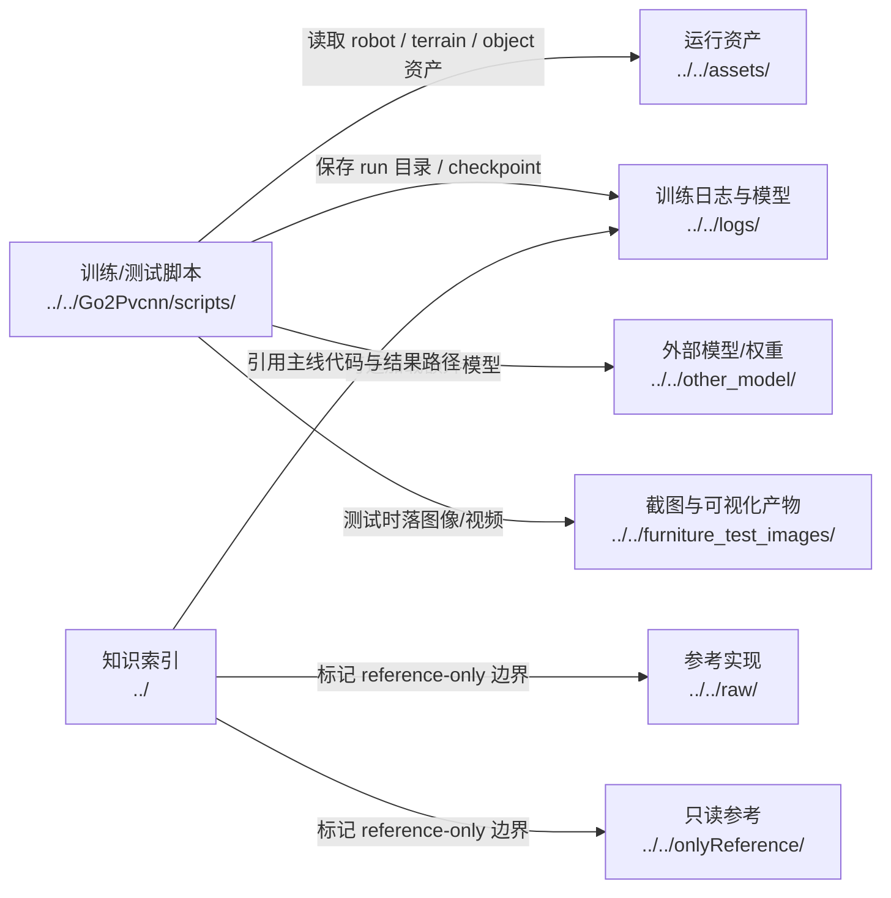

# Human Assets Paths And Experiments

## 导航

- 文档类型：`human` 阶段文档
- 对应 AI 文档：[../ai/ai-06-assets-paths-and-experiments.md](../ai/ai-06-assets-paths-and-experiments.md)
- 上一篇：[human-05-ppo-and-runner.md](human-05-ppo-and-runner.md)
- 下一篇：[human-07-manual-tuning-guide.md](human-07-manual-tuning-guide.md)
- 总索引：[../index.md](../index.md)

## 作用

说明当前仓库里哪些目录保存模型、资产、日志、截图和参考资料，以及哪些目录默认不能当成主项目改动目标。

## Mermaid 路径关系图

## 重点目录

- [assets](../../assets)
- [logs](../../logs)
- [other_model](../../other_model)
- [furniture_test_images](../../furniture_test_images)
- [raw](../../raw)
- [onlyReference](../../onlyReference)

## 上游输入

- 训练和测试脚本写出的产物
- 手工准备的 USD 资产和 checkpoint

## 下游消费者

- 恢复训练
- 回放、分析和人工检查
- 后续实验复现实验环境

## 待补充

- 当前项目依赖的关键资产清单
- 哪些路径是机器相关绝对路径
- 哪些目录必须视为 reference-only
