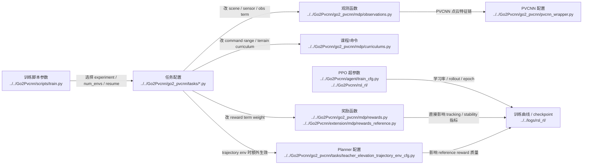

# Human Manual Tuning Guide

## 导航

- 文档类型：`human` 专题文档
- 对应 AI 文档：[../ai/ai-07-manual-tuning-reference.md](../ai/ai-07-manual-tuning-reference.md)
- 上一篇：[human-06-assets-paths-and-experiments.md](human-06-assets-paths-and-experiments.md)
- 下一篇：无
- 总索引：[../index.md](../index.md)

## 作用

把“手工调参时该去哪里改、改完影响哪里、哪些东西高风险”集中收口，避免每次重新翻目录。

## Mermaid 调参地图

## 重点范围

- task cfg 中的奖励、地形、观测和 curriculum
- LiDAR / PVCNN 相关采样参数
- PPO runner / algorithm 超参数
- checkpoint、资产和实验路径

## 常用参数索引

| 参数主题 | 定义地址 | 主要消费者 | 影响 | 风险提示 |
| --- | --- | --- | --- | --- |
| `learning_rate` / `num_steps_per_env` / `num_learning_epochs` | [../../Go2Pvcnn/agent/train_cfg.py](../../Go2Pvcnn/agent/train_cfg.py) | [../../Go2Pvcnn/scripts/train.py](../../Go2Pvcnn/scripts/train.py), `OnPolicyRunner`, `PPO` | 决定 rollout 长度、更新频率和学习速度 | 改太大容易直接把训练稳定性打坏 |
| `lin_vel_x` / `lin_vel_y` / `ang_vel_z` 命令范围 | [../../Go2Pvcnn/go2_pvcnn/tasks/teacher_without_semantic_env_cfg.py](../../Go2Pvcnn/go2_pvcnn/tasks/teacher_without_semantic_env_cfg.py), [../../Go2Pvcnn/go2_pvcnn/tasks/teacher_semantic_env_cfg.py](../../Go2Pvcnn/go2_pvcnn/tasks/teacher_semantic_env_cfg.py), [../../Go2Pvcnn/go2_pvcnn/tasks/teacher_elevation_env_cfg.py](../../Go2Pvcnn/go2_pvcnn/tasks/teacher_elevation_env_cfg.py) | `generated_commands`, curriculum 更新逻辑, reward tracking 项 | 决定训练任务难度和速度分布 | 改范围但不配套 reward / curriculum，容易学不动或学歪 |
| `height_scanner` 分辨率与范围 | [../../Go2Pvcnn/go2_pvcnn/tasks/teacher_elevation_env_cfg.py](../../Go2Pvcnn/go2_pvcnn/tasks/teacher_elevation_env_cfg.py), [../../Go2Pvcnn/go2_pvcnn/tasks/teacher_elevation_trajectory_env_cfg.py](../../Go2Pvcnn/go2_pvcnn/tasks/teacher_elevation_trajectory_env_cfg.py) | [../../Go2Pvcnn/go2_pvcnn/mdp/observations.py](../../Go2Pvcnn/go2_pvcnn/mdp/observations.py), [../../Go2Pvcnn/extension/mdp/observations.py](../../Go2Pvcnn/extension/mdp/observations.py) | 决定 elevation map 尺寸、planner 地形精度 | 改 shape 会连带影响 CNN 输入和 planner 假设 |
| `elevation_map` / `downsampled_height_scan` 观测项 | [../../Go2Pvcnn/go2_pvcnn/tasks/teacher_elevation_env_cfg.py](../../Go2Pvcnn/go2_pvcnn/tasks/teacher_elevation_env_cfg.py), [../../Go2Pvcnn/go2_pvcnn/tasks/teacher_elevation_trajectory_env_cfg.py](../../Go2Pvcnn/go2_pvcnn/tasks/teacher_elevation_trajectory_env_cfg.py) | [../../Go2Pvcnn/go2_pvcnn/mdp/observations.py](../../Go2Pvcnn/go2_pvcnn/mdp/observations.py), `obs_groups` in [../../Go2Pvcnn/agent/train_cfg.py](../../Go2Pvcnn/agent/train_cfg.py) | 决定 actor / critic 实际吃到哪组图像观测 | 改 observation group 名称会直接把训练配置弄断 |
| semantic cost map / PVCNN 观测链 | [../../Go2Pvcnn/go2_pvcnn/mdp/observations.py](../../Go2Pvcnn/go2_pvcnn/mdp/observations.py), [../../Go2Pvcnn/go2_pvcnn/pvcnn_wrapper.py](../../Go2Pvcnn/go2_pvcnn/pvcnn_wrapper.py) | `teacher_semantic` env, `RslRlPvcnnEnvWrapper` | 决定点云怎么变成 cost map / 特征 | 点数、特征维、checkpoint 不匹配时最容易直接报错 |
| `track_lin_vel_xy*` / `track_ang_vel_z*` 奖励 | [../../Go2Pvcnn/go2_pvcnn/tasks/teacher_without_semantic_env_cfg.py](../../Go2Pvcnn/go2_pvcnn/tasks/teacher_without_semantic_env_cfg.py), [../../Go2Pvcnn/go2_pvcnn/tasks/teacher_semantic_env_cfg.py](../../Go2Pvcnn/go2_pvcnn/tasks/teacher_semantic_env_cfg.py) | reward manager, curriculum `lin_vel_cmd_levels` | 决定速度跟踪目标和 curriculum 推进依据 | 奖励项改名或去掉会把 curriculum 一起影响到 |
| trajectory reward 权重 | [../../Go2Pvcnn/go2_pvcnn/tasks/teacher_elevation_trajectory_env_cfg.py](../../Go2Pvcnn/go2_pvcnn/tasks/teacher_elevation_trajectory_env_cfg.py) | [../../Go2Pvcnn/extension/mdp/rewards_reference.py](../../Go2Pvcnn/extension/mdp/rewards_reference.py) | 决定 imitation tracking 哪部分更重要 | 权重大改会让策略偏向 reference 而忽略基础 locomotion reward |
| `reference_trajectory_horizon` / `reference_replan_interval_steps` | [../../Go2Pvcnn/go2_pvcnn/tasks/teacher_elevation_trajectory_env_cfg.py](../../Go2Pvcnn/go2_pvcnn/tasks/teacher_elevation_trajectory_env_cfg.py) | [../../Go2Pvcnn/extension/batched_planner/manager.py](../../Go2Pvcnn/extension/batched_planner/manager.py), [../../Go2Pvcnn/extension/mdp/rewards_reference.py](../../Go2Pvcnn/extension/mdp/rewards_reference.py) | 决定 reference 长度和重规划频率 | 改太短会 reference 抖动，改太长会 reference 变旧 |
| `step_height` / `foothold_search_radius` / `max_roughness` | [../../Go2Pvcnn/go2_pvcnn/tasks/teacher_elevation_trajectory_env_cfg.py](../../Go2Pvcnn/go2_pvcnn/tasks/teacher_elevation_trajectory_env_cfg.py), [../../Go2Pvcnn/extension/batched_planner/config.py](../../Go2Pvcnn/extension/batched_planner/config.py) | [../../Go2Pvcnn/extension/batched_planner/trajectory.py](../../Go2Pvcnn/extension/batched_planner/trajectory.py), `swing.py`, `foothold.py` | 决定 planner 足端摆动与落脚候选搜索 | 很容易让 reference 质量变化，但表面上只看到 reward 波动 |

## 使用建议

- 先改 task cfg，再确认 observation / reward / runner 三边有没有一起对齐
- 只改一个高风险参数时，优先固定其他变量，不然很难判断是谁导致训练变化
- trajectory 相关参数尽量结合 [human-10-extension-planner-runtime.md](human-10-extension-planner-runtime.md) 和 [human-11-extension-trajectory-reward.md](human-11-extension-trajectory-reward.md) 一起看
