# Human Extension Planner Reading Guide

## 导航

- 文档类型：`human` planner 子线阅读入口
- 对应 AI 文档：[../ai/ai-08-extension-planner-reading-guide.md](../ai/ai-08-extension-planner-reading-guide.md)
- 上一篇：[human-07-manual-tuning-guide.md](human-07-manual-tuning-guide.md)
- 下一篇：[human-09-extension-planner-mapping.md](human-09-extension-planner-mapping.md)
- 总索引：[../index.md](../index.md)
- raw 参考索引：[../../raw/kinematic_footsteps/notes/index.md](../../raw/kinematic_footsteps/notes/index.md)

## 这条子线为什么存在

这条子线专门服务于当前的 `kinematic planner` 主线阅读。

它的目标不是重复讲 `raw/kinematic_footsteps` 的 planner 细节，而是先帮你分清仓库里其实并存的三层东西，再回答后续实现问题。

进入这条子线之前，先建立一个最小心智模型：

1. `raw/kinematic_footsteps/scripts/go2fp/*`
   原始 CPU、单样本、语义金标准。

2. `Go2Pvcnn/extension/reference/*`
   当前保留下来的 reference 边界层。
   它负责 `ReferenceTrajectoryCache`、raw bridge 和少量参考轨迹辅助能力。

3. `Go2Pvcnn/extension/batched_planner/*`
   当前 batched pure GPU 主线，也是现在真正应该维护的 planner 实现。

在这个前提下，这条子线主要回答四件事：

- 当前项目为什么需要一套 Isaac Lab 对齐的 planner
- `raw/kinematic_footsteps`、`extension/reference`、当前 `extension/batched_planner` 之间是什么关系
- kinematic planner 和 Isaac Lab 的接口边界在哪里
- 后续当 `raw` 更新时，应该先看哪些文档、再同步哪些代码

## 推荐顺序

1. [human-09-extension-planner-mapping.md](human-09-extension-planner-mapping.md)
2. [human-10-extension-planner-runtime.md](human-10-extension-planner-runtime.md)
3. [human-11-extension-trajectory-reward.md](human-11-extension-trajectory-reward.md)

如果你当前最关心的是：

- `原始 CPU` 和 `当前 pure GPU` 差别是什么  
  先看 [human-09-extension-planner-mapping.md](human-09-extension-planner-mapping.md)

- planner 和 Isaac Lab 到底怎么接起来  
  先看 [human-10-extension-planner-runtime.md](human-10-extension-planner-runtime.md)

- planner 输出最后怎么变成 reward  
  先看 [human-11-extension-trajectory-reward.md](human-11-extension-trajectory-reward.md)

如果你还没看过 `raw` 的 planner 主线，先补读：

1. [../../raw/kinematic_footsteps/notes/index.md](../../raw/kinematic_footsteps/notes/index.md)
2. [../../raw/kinematic_footsteps/notes/human/human-01-overall-pipeline.md](../../raw/kinematic_footsteps/notes/human/human-01-overall-pipeline.md)

## 当前项目里的 planner 核心约束

- 当前项目只保留一个 `height_scanner`
- 这个 scanner 的覆盖范围是 `1.5 x 1.5 m`
- scanner 原始分辨率是 `0.01 m`
- planner 直接消费高精度高程图
- policy / critic 只输入从高精度图降采样到 `0.1 m` 的版本
- planner 输出不进入 observation，只进入 reward

## Mermaid planner 子线入口图

```mermaid
graph LR
    raw["raw 语义金标准\n../../raw/kinematic_footsteps/scripts/go2fp/"]
    reference["reference 边界层\n../../Go2Pvcnn/extension/reference/"]
    batched["batched GPU 主线\n../../Go2Pvcnn/extension/batched_planner/"]
    convention["Isaac / planner 格式边界\n../../Go2Pvcnn/extension/convention.py"]
    envcfg["trajectory env cfg\n../../Go2Pvcnn/go2_pvcnn/tasks/teacher_elevation_trajectory_env_cfg.py"]
    manager["runtime manager\n../../Go2Pvcnn/extension/batched_planner/manager.py"]
    rewards["reward 消费层\n../../Go2Pvcnn/extension/mdp/rewards_reference.py"]

    raw -->|"提供模块语义基准"| batched
    raw -->|"raw go2fp 对齐 / parity"| reference
    envcfg -->|"配置高分辨率 scanner / reward term"| convention
    convention -->|"把 Isaac state 翻译给 planner"| batched
    batched -->|"整段 trajectory result"| manager
    manager -->|"缓存当前 reference"| rewards
    manager -->|"ReferenceTrajectoryCache"| reference
    batched -->|"对齐时回查"| raw
```

## 本文与其他文档的关系

- 本文是 extension planner 子线的入口
- 真正的 raw <-> extension 对照关系在 [human-09-extension-planner-mapping.md](human-09-extension-planner-mapping.md)
- runtime 设计在 [human-10-extension-planner-runtime.md](human-10-extension-planner-runtime.md)
- 轨迹奖励设计在 [human-11-extension-trajectory-reward.md](human-11-extension-trajectory-reward.md)
- 如果需要统一入口和阅读顺序，回到 [../index.md](../index.md)
