# Human Extension Planner Mapping

## 导航

- 文档类型：`human` raw 到 batched planner 的映射文档
- 对应 AI 文档：[../ai/ai-09-extension-planner-mapping.md](../ai/ai-09-extension-planner-mapping.md)
- 上一篇：[human-08-extension-planner-reading-guide.md](human-08-extension-planner-reading-guide.md)
- 下一篇：[human-10-extension-planner-runtime.md](human-10-extension-planner-runtime.md)
- 总索引：[../index.md](../index.md)
- raw 参考索引：[../../raw/kinematic_footsteps/notes/index.md](../../raw/kinematic_footsteps/notes/index.md)

## 目的

这篇文档维护：

- `raw/kinematic_footsteps/scripts/go2fp/*`
- `Go2Pvcnn/extension/batched_planner/*`

之间的映射关系，以及 batched 方案和 `extension/reference/*` 边界层的关系。

## 当前总览

当前主线已经从旧的 `extension/planner/*` + raw EventTerm 运行时，切到新的 `extension/batched_planner/*`：

1. `raw/kinematic_footsteps/scripts/go2fp/*` 仍然是语义金标准  
   新模块以 raw 为逐项对齐对象。

2. `extension/batched_planner/*` 是新的 GPU / batched 实现  
   输入输出 shape 统一带 `(N, ...)` batch 维，目标是端到端替代旧 planner runtime。

3. `extension/convention.py`、`extension/mdp/rewards_reference.py`、`extension/batched_planner/manager.py`、`extension/reference/*`  
   构成 batched planner 和 Isaac / reward / raw parity 之间的接口层。

4. 旧的 `extension/planner/*`、`extension/tasks/*`、`extension/mdp/reference_trajectory_events.py`  
   已经从当前仓库主线中删除，不再是目标架构。

## Mermaid 模块映射图

```mermaid
graph LR
    rawtypes["raw types\n../../raw/kinematic_footsteps/scripts/go2fp/types.py"]
    rawtraj["raw trajectory\n../../raw/kinematic_footsteps/scripts/go2fp/trajectory.py"]
    rawmods["raw gait/foothold/swing/ik\n../../raw/kinematic_footsteps/scripts/go2fp/"]
    btypes["batched types/config\n../../Go2Pvcnn/extension/batched_planner/types.py\n../../Go2Pvcnn/extension/batched_planner/config.py"]
    bmods["batched 子模块\n../../Go2Pvcnn/extension/batched_planner/gait.py\n../../Go2Pvcnn/extension/batched_planner/foothold.py\n../../Go2Pvcnn/extension/batched_planner/ik.py"]
    btraj["batched trajectory\n../../Go2Pvcnn/extension/batched_planner/trajectory.py"]
    convention["convention\n../../Go2Pvcnn/extension/convention.py"]
    manager["manager\n../../Go2Pvcnn/extension/batched_planner/manager.py"]
    reference["reference 层\n../../Go2Pvcnn/extension/reference/"]
    reward["reward bridge\n../../Go2Pvcnn/extension/mdp/rewards_reference.py"]

    rawtypes -->|"常量/状态结构对齐"| btypes
    rawmods -->|"逐模块语义迁移"| bmods
    rawtraj -->|"主入口语义对齐"| btraj
    btypes -->|"BatchedRobotState / Result"| convention
    convention -->|"Isaac state <-> planner state"| btraj
    btraj -->|"整段结果缓存化"| manager
    rawtraj -->|"raw 对齐桥接"| reference
    manager -->|"当前 phase slice"| reward
    reference -->|"ReferenceTrajectoryCache / raw bridge"| reward
```

## 三层 planner 要分开看

现在仓库里和 `kinematic planner` 有关的实现，主要有三层，不能混成一个概念：

1. `raw/kinematic_footsteps/scripts/go2fp/*`
   这是原始 **CPU / 单样本 / NumPy + Python 对象** 版本。
   输入是单个 terrain、单个 robot state、单个 command。
   输出是单条 `TrajectoryResult`。
   它的职责是提供算法语义金标准，而不是直接接 Isaac Lab 大批量训练。

2. `Go2Pvcnn/extension/reference/*`
   这是当前保留下来的 **reference 边界层**。
   它负责 `ReferenceTrajectoryCache`、placeholder reference generator，以及 raw `go2fp` 对齐桥接。
   这层不是 planner 算法本体，而是 batched planner 与 reward / parity test 之间的辅助层。

3. `Go2Pvcnn/extension/batched_planner/*`
   这是当前主线的 **pure GPU / batched / torch tensor** 版本。
   输入输出默认都按 `(N, ...)` 组织，目标是在 Isaac Lab 训练回路里直接批量生成 reference trajectory。
   这层才是现在要维护和扩展的 planner 实现主体。

## 原始 CPU 和当前 pure GPU 的区别

这两者的核心区别，不只是“一个旧一个新”，而是执行模型完全不同：

- raw CPU 版本  
  更像算法参考实现。按单个样本一步步算，天然适合阅读、对照、验语义。

- pure GPU batched 版本  
  更像训练时运行内核。所有状态、地形、command、trajectory 都按 batch tensor 一次性推进，减少 Python 循环和 CPU 往返。

- raw CPU 的接口是面向算法对象的  
  例如单个 `terrain`、单个 `Command`、单个 `initial_state`。

- pure GPU 的接口是面向训练批处理的  
  例如 `(N, 3)` command、`BatchedRobotState`、`(N, H, W)` 或 batched query 形式的 terrain 采样。

- raw CPU 的价值在“语义基准”  
  batched GPU 的价值在“训练吞吐 + 多环境对齐”。

当前开发时的正确心智模型应该是：

- **raw CPU 决定算法应该算成什么样**
- **batched pure GPU 决定 Isaac Lab 训练时如何高吞吐地算出来**

## raw 到 batched_planner 映射

| raw planner                                                  | batched planner                                           | 说明                                                   |
| ------------------------------------------------------------ | --------------------------------------------------------- | ---------------------------------------------------- |
| `raw/kinematic_footsteps/scripts/go2fp/types.py`             | `Go2Pvcnn/extension/batched_planner/types.py`             | 常量、状态结构、结果结构                                         |
| `raw/kinematic_footsteps/scripts/go2fp/config.py`            | `Go2Pvcnn/extension/batched_planner/config.py`            | batched planner 配置                                   |
| `raw/kinematic_footsteps/scripts/go2fp/gait.py`              | `Go2Pvcnn/extension/batched_planner/gait.py`              | gait schedule、touchdown、swing event                  |
| `raw/kinematic_footsteps/scripts/go2fp/foothold.py`          | `Go2Pvcnn/extension/batched_planner/foothold.py`          | spiral offsets、Raibert foothold、touchdown evaluation |
| `raw/kinematic_footsteps/scripts/go2fp/swing.py`             | `Go2Pvcnn/extension/batched_planner/swing.py`             | swing target 生成                                      |
| `raw/kinematic_footsteps/scripts/go2fp/terrain_estimator.py` | `Go2Pvcnn/extension/batched_planner/terrain_estimator.py` | terrain roll/pitch/height EMA                        |
| `raw/kinematic_footsteps/scripts/go2fp/base_solver.py`       | `Go2Pvcnn/extension/batched_planner/base_solver.py`       | base integration / orientation / clearance           |
| `raw/kinematic_footsteps/scripts/go2fp/ik.py`                | `Go2Pvcnn/extension/batched_planner/ik.py`                | IK / FK / root-relative body links                   |
| `raw/kinematic_footsteps/scripts/go2fp/trajectory.py`        | `Go2Pvcnn/extension/batched_planner/trajectory.py`        | batched 主入口                                          |
| `raw/kinematic_footsteps/scripts/go2fp/viewer.py`            | `Go2Pvcnn/extension/viz/compare_trajectories.py`          | 不复用 MuJoCo viewer，改成数值对齐工具                           |

## 新增 Isaac / 项目层模块

这些模块在 raw 中没有同构文件：

- `Go2Pvcnn/extension/convention.py`
- `Go2Pvcnn/extension/batched_planner/manager.py`
- `Go2Pvcnn/extension/mdp/rewards_reference.py`
- `Go2Pvcnn/extension/reference/*`
- `Go2Pvcnn/go2_pvcnn/tasks/teacher_elevation_trajectory_env_cfg.py`
- `Go2Pvcnn/extension/viz/compare_trajectories.py`

## kinematic planner 和 Isaac Lab 的接口关系

当前主线里，planner 和 Isaac Lab 不是直接“硬耦合”在一起，而是通过一层明确的边界模块接起来：

1. `go2_pvcnn/tasks/teacher_elevation_trajectory_env_cfg.py`
   定义 Isaac Lab 任务配置。
   这里决定会不会启用 batched reference trajectory，以及 planner 需要的高分辨率 `height_scanner` 和 reward 项。

2. `extension/convention.py`
   这是 **Isaac <-> planner 的格式边界**。
   这里处理 quaternion 顺序、Isaac state 到 planner state 的转换，以及 planner result 到 reference cache 的转换。

3. `extension/batched_planner/manager.py`
   这是 **训练步进时的 runtime 边界**。
   它负责固定间隔 replan、保存 cache、推进 phase，而不是让 reward 或 env cfg 自己直接调 trajectory 主入口。

4. `extension/mdp/rewards_reference.py`
   这是 **Isaac reward 消费边界**。
   reward 不直接理解 batched planner 内部模块，它只消费 `_trajectory_reference_cache` 当前 phase 的参考帧。

所以更准确地说：

- `batched_planner/*` 负责“算 reference trajectory”
- `convention.py` 负责“把 Isaac 的状态/姿态约定翻译给 planner，再把 planner 结果翻译回缓存”
- `manager.py` 负责“在 Isaac step 过程中决定什么时候重规划、当前该取哪一帧”
- `rewards_reference.py` 负责“把当前帧 reference 变成 imitation reward”

这也是为什么现在讲 planner 架构时，不能只看 `trajectory.py`，必须把 `env cfg -> convention -> manager -> reward` 这条接口链一起看。

## 已删除旧路径

以下路径已经从当前仓库主线删除：

- `Go2Pvcnn/extension/planner/*`
- `Go2Pvcnn/extension/mdp/reference_trajectory_events.py`
- `Go2Pvcnn/extension/tasks/teacher_elevation_trajectory_env_cfg.py`

如果以后在历史记录、旧笔记或旧分支里再看到这些路径，应把它们当成历史实现，而不是当前可维护入口。

## 同步规则

- raw 行为变化：先更新本篇映射，再更新 `extension/batched_planner/*`
- `TrajectoryResult` / 状态字段变化：同时更新 `types.py`、`convention.py`、reward 消费路径
- runtime 行为变化：同步更新 [human-10](human-10-extension-planner-runtime.md) 和 [human-11](human-11-extension-trajectory-reward.md)
