# Human Extension Planner Runtime

## 导航

- 文档类型：`human` planner runtime 设计
- 对应 AI 文档：[../ai/ai-10-extension-planner-runtime.md](../ai/ai-10-extension-planner-runtime.md)
- 上一篇：[human-09-extension-planner-mapping.md](human-09-extension-planner-mapping.md)
- 下一篇：[human-11-extension-trajectory-reward.md](human-11-extension-trajectory-reward.md)
- 总索引：[../index.md](../index.md)
- raw 参考索引：[../../raw/kinematic_footsteps/notes/index.md](../../raw/kinematic_footsteps/notes/index.md)

## 一句话总结

当前 runtime 采用（更新于 2026-04-15）：

`Isaac state + 高分辨率 height_scanner -> BatchedTrajectoryManager.refresh_from_env() -> (按需单次 planner 调用, 支持 per-env masked replan) -> planner-owned ReferenceTrajectoryCache -> reward / viewer 消费`

核心特征是：

- planner-owned cache：reward/viewer 不再依赖“外部 cache 生成器”，而是必须通过 `env.unwrapped._trajectory_manager` 刷新 cache。
- single-shot / per-env 解耦：每次 runtime 刷新最多触发一次规划调用；只对需要重规划的 env 行进行 batched 规划，并把结果写回完整 cache。
- full cache contract：即使发生部分重规划，reward 侧看到的 cache 仍保持 `(num_envs, horizon, ...)` 的完整形状契约。
- standstill 退化路径：某些 env 规划失败时，将其 cache 行置为站立（时间常量）并持续到它自己的下一次 replan 触发。
- verbose planner 诊断：可按步数间隔打印 planner timing summary，便于定位性能瓶颈。

## Mermaid runtime 主链图

```mermaid
graph LR
    env["Isaac Lab env / scene\n../../Go2Pvcnn/go2_pvcnn/tasks/teacher_elevation_trajectory_env_cfg.py"]
    scanner["高分辨率 height_scanner\nRayCasterCfg 0.01m / 1.5x1.5m"]
    convention["Isaac -> planner 状态翻译\n../../Go2Pvcnn/extension/convention.py"]
    trajectory["batched planner 主入口\n../../Go2Pvcnn/extension/batched_planner/trajectory.py"]
    manager["BatchedTrajectoryManager\n../../Go2Pvcnn/extension/batched_planner/manager.py"]
    cache["planner-owned ReferenceTrajectoryCache\n(env.unwrapped._trajectory_manager.refresh_from_env)\n+ runtime mirror: env.unwrapped._trajectory_reference_cache"]
    reward["reward helper\n../../Go2Pvcnn/extension/mdp/rewards_reference.py"]
    step["每步 RL reward"]

    env -->|"root pose / joint / foot / command"| convention
    env -->|"提供 terrain raster"| scanner
    scanner -->|"height map 查询输入"| trajectory
    convention -->|"BatchedRobotState"| trajectory
    trajectory -->|"BatchedTrajectoryResult"| manager
    manager -->|"planner_result_to_reference_cache\n+ masked write rows"| cache
    manager -->|"per-env replan mask\n+ phase counter"| cache
    cache -->|"ensure_reference_cache()\n按当前 frame gather"| reward
    reward -->|"root/joint/foot/contact/touchdown tracking"| step
```



## runtime 里到底谁和谁对接

如果只看 `trajectory.py`，很容易误以为 planner 直接吃 Isaac 数据。实际主线 runtime 是分层的：

1. Isaac Lab env / scene 提供：
   - root pose
   - joint state
   - foot body positions
   - command
   - `height_scanner`

2. `extension/convention.py`
   把 Isaac 的状态约定翻译成 planner 能吃的 batched state。
   最典型的是 quaternion 顺序和 batched tensor shape 的统一。

3. `extension/batched_planner/trajectory.py`
   只负责 planner 语义本身，不直接关心 reward manager、EventTerm 或 task 注册。

4. `extension/batched_planner/manager.py`
   把一次 planner 结果变成多步可消费的 reference runtime，并且负责：

   - planner-owned cache 的生命周期
   - per-env masked 重规划（只对需要重规划的 env 子集调用 planner）
   - 将子集结果写回完整 cache（reward 侧始终看到 full-shaped cache）
   - 规划失败时的 standstill 退化

5. `extension/mdp/rewards_reference.py`
   在每个 RL step 上读取当前 phase 的参考帧，计算 imitation-style reward。
   注意：这里的 cache 入口是 `ensure_reference_cache(env)`，它要求 `env.unwrapped._trajectory_manager` 存在。

## 当前主流程

1. 环境提供当前 batched robot state、command、height scanner 地形
2. reward/viewer 侧通过 `ensure_reference_cache(env)` 触发 `BatchedTrajectoryManager.refresh_from_env(env)`
3. manager 计算 per-env `replan_mask` 并最多触发一次 `batched_generate_trajectory(...)`
4. 结果经 `extension/convention.py::planner_result_to_reference_cache()` 转成 canonical cache ABI
5. 若是部分重规划：将子集 cache 行 masked 写回到完整 cache（full cache contract）
6. manager 维护 per-env `phase_counter` 并在每次 refresh/step 时推进或重置
7. reward 在每步通过当前 phase 从 cache 里取参考帧

## MPC 语义障碍内部 command shaping（2026-05-24）

`extension/batch_mpc_planner` 在 T302h 之后新增一层内部语义策略：

- 外部 runtime / manager 仍把原始 command 传给 `plan_segment(...)`。
- `plan_segment(...)` 会先检查语义高度图中命令走廊内的低小障碍物、高小障碍物和大障碍物。
- 低小障碍物不改内部 command，而是通过 low-small crossing / foot / stepcap loss 约束“跨过去且连续”。
- 高小障碍物和大障碍物会生成内部 `planning_command`：降低前向速度，并向较空的一侧加入横向速度。
- 这个 `planning_command` 同时用于 nominal 构建和 MPC optimizer/loss。只改 nominal seed 会被 tracking 拉回原命令，已在 T302h large-forward 探针中验证会留下连续性失败。
- 外部 command contract 不变；这只是本次 MPC 规划内部的避障速度整形。

证据：[../log/2026-05-24-1948-t302h-production-v10-implementation.md](../log/2026-05-24-1948-t302h-production-v10-implementation.md)

## MPC 重规划相位默认值（2026-05-24）

`extension/batch_mpc_planner` 现在默认关闭 `MpcRuntimeCfg.randomize_replan_phase`。

原因是 T302h 多周期真实 IsaacLab probe 发现，语义大障碍前进场景的剩余间歇性失败来自 replan 边界的 gait phase 随机切换：下一段 nominal 可能选择不同对角相位，导致 frame-0 足端跳变。默认改为 deterministic phase 后，large-forward 多周期从 `semantic_task=1/6`、continuity `1/6` 改为 `semantic_task=0/6`、continuity `0/6`。

保留任务级 override：`mpc_randomize_replan_phase=True` 可显式恢复随机 replan phase，用于后续消融或训练随机化实验。

证据：[../log/2026-05-24-2109-t302h-deterministic-replan-phase.md](../log/2026-05-24-2109-t302h-deterministic-replan-phase.md)

## 基于真实 Isaac Lab headless runtime 的执行证据（2026-04-19）

上面是静态代码主链。为了确认“planner 本身、playback 写回、viewer 启动链路”到底哪一层有问题，当前仓库里已经补了一组真实 runtime diagnostics tests，它们不是 mock 一个假 planner，而是尽量沿着 `go2_foostep_planner.py` 的启动路径走：

- 入口参考：
  - `Go2Pvcnn/extension/viz/go2_foostep_planner.py`
    - `_build_env_cfg(...)`
    - `_build_planner_cfg(...)`
    - `_planner_state_from_env(...)`
    - `_compute_local_terrain(...)`
    - `_apply_direct_playback_to_robot(...)`
- 测试实现：
  - `Go2Pvcnn/tests/fixtures/viewer_runtime_diagnostics.py`
  - `Go2Pvcnn/tests/test_viewer_runtime_diagnostics.py`
  - `Go2Pvcnn/tests/test_batched_planner_stage_diagnostics.py`

### 1. diagnostics fixture 的真实执行链

真实 runtime fixture `make_real_runtime_fixture(...)` 的链路可以压缩成：

`AppLauncher(headless) -> TeacherElevationTrajectoryEnvCfg_PLAY -> gym.make("Isaac-Teacher-Elevation-Trajectory-Go2-Play-v0") -> _attach_reference_manager_if_enabled(...) -> _planner_state_from_env(...) / _terrain_from_env(...) -> batched_generate_trajectory(...)`

其中和 viewer 主代码保持一致的关键点有：

- headless 启动，不依赖 viewer GUI
- command 不是模拟 stdin，而是直接数值注入 batched command tensor
- terrain 输入来自真实 `height_scanner.data.ray_hits_w`
- planner 输入状态来自真实 `robot.data.root_pos_w / root_quat_w / joint_pos / body_pos_w`
- playback 校验不是“写完就读”，而是显式走：
  - `_apply_direct_playback_to_robot(...)`
  - `scene.write_data_to_sim()`
  - `sim.render()`
  - `scene.update(physics_dt)`
  - 再读 authoritative robot buffers

这条链和 `onlyReference/unitree_rl_lab/scripts/mimic/replay_npz.py` 的 replay contract 是对齐的。

### 2. viewer runtime diagnostics 证明了什么

当前已经通过的关键测试包括：

- `test_viewer_forward_command_changes_plan_motion_metrics`
- `test_viewer_lateral_command_changes_plan_motion_metrics`
- `test_viewer_yaw_command_changes_yaw_and_touchdown_metrics`
- `test_viewer_playback_matches_reference_frame_numeric`
- `test_viewer_standstill_has_no_single_leg_outlier`
- `test_viewer_leg_order_matches_planner_contract`
- `test_viewer_batched_runtime_smoke_preserves_parallel_path`

执行命令：

```bash
/home/lhy/anaconda3/envs/env_isaaclab/bin/python -m pytest Go2Pvcnn/tests/test_viewer_runtime_diagnostics.py -q
```

结果：

- `10` 个点通过
- 这说明：
  - 只要 command 真的进 planner，`forward / lateral / yaw` 都能在 result 上表现出正确方向的运动学响应
  - 当前机器人 foot order 与 planner `LEG_ORDER = (FL, FR, RL, RR)` 是一致的
  - standstill 不会在 planner 输出里天然制造“单腿离群”
  - 如果 playback 采用 `write_data_to_sim -> render -> scene.update` 这条同步契约，robot 读回状态和 reference frame 可以数值对齐

### 3. planner stage diagnostics 的真实输出

下面这组输出来自：

```bash
/home/lhy/anaconda3/envs/env_isaaclab/bin/python -m pytest Go2Pvcnn/tests/test_batched_planner_stage_diagnostics.py::test_planner_stage_diagnostics_emit_summary -s -q
```

输出片段如下：

```text
[planner-diag] case=standstill
  - input: command_vx_mean=+0.0000 command_vy_mean=+0.0000 command_yaw_mean=+0.0000
  - standstill: path_dx_mean=+0.0000 path_dy_mean=+0.0000 yaw_delta_mean=+0.0000 standstill_ratio=+1.0000 ...
  - result: path_dx_mean=+0.0000 path_dy_mean=+0.0000 yaw_delta_mean=+0.0000 standstill_ratio=+1.0000 ...

[planner-diag] case=forward
  - input: command_vx_mean=+0.3000 ...
  - gait: contact_mean=+0.6250
  - footholds: touchdown_dx_mean=+0.1883 touchdown_delta_norm_max=+0.2823
  - touchdown_eval: touchdown_dx_mean=+0.1883 touchdown_delta_norm_max=+0.2823 feasible_ratio=+1.0000
  - base_approx: path_dx_mean=+0.1140 path_dy_mean=+0.0000 yaw_delta_mean=+0.0000 standstill_ratio=+0.0000
  - base_solve: path_dx_mean=+0.1140 path_dy_mean=+0.0000 yaw_delta_mean=+0.0000 standstill_ratio=+0.0000
  - result: path_dx_mean=+0.1140 path_dy_mean=+0.0000 yaw_delta_mean=+0.0000 standstill_ratio=+0.0000 touchdown_dx_mean=+0.1883 touchdown_delta_norm_max=+0.2823 contact_mean=+0.6250

[planner-diag] case=yaw_left
  - input: command_yaw_mean=+0.3000
  - gait: contact_mean=+0.6250
  - footholds: touchdown_dx_mean=+0.0308 touchdown_delta_norm_max=+0.1142
  - touchdown_eval: touchdown_dx_mean=+0.0308 touchdown_delta_norm_max=+0.1142 feasible_ratio=+1.0000
  - base_approx: path_dx_mean=+0.0000 path_dy_mean=+0.0000 yaw_delta_mean=+0.1140 standstill_ratio=+0.0000
  - base_solve: path_dx_mean=+0.0000 path_dy_mean=+0.0000 yaw_delta_mean=+0.1140 standstill_ratio=+0.0000
  - result: path_dx_mean=+0.0000 path_dy_mean=+0.0000 yaw_delta_mean=+0.1140 standstill_ratio=+0.0000 touchdown_dx_mean=+0.0308 touchdown_delta_norm_max=+0.1142 contact_mean=+0.6250
```

这组输出可以直接得出三个结论：

1. `forward` 命令已经穿过 `input -> footholds -> base_approx -> base_solve -> result` 全链路。
2. `yaw_left` 命令不是只有 marker 在动，planner 内部的 `yaw_delta_mean` 也确实在增长。
3. `standstill` case 在 `standstill/result` 阶段是时间常量，没有出现 planner 侧的单腿异常信号。

### 4. result vs playback 的直接数值证据

下面这组输出来自：

```bash
/home/lhy/anaconda3/envs/env_isaaclab/bin/python -m pytest Go2Pvcnn/tests/test_batched_planner_stage_diagnostics.py::test_planner_output_vs_playback_emit_report -s -q
```

输出片段：

```text
[playback-diag] case=forward frame_idx=7 root_pos_max_abs=0.000000 root_pos_mean_abs=0.000000 joint_pos_max_abs=0.000000 joint_pos_mean_abs=0.000000 path_dx_mean=+0.114000 path_dy_mean=+0.000000 yaw_delta_mean=+0.000000 standstill_ratio=+0.000000
```

这条非常重要，因为它说明：

- 在当前测试使用的 replay contract 下，
  `planner result -> robot playback` 的 root / joint 数值误差基本是 `0`
- 所以“planner 已经规划对了，但机器人本体姿态还是怪”的问题，并不是 playback 在数学上天然做不到，而更像是：
  - 真正 viewer 主循环里采用了不同的同步契约
  - 或者输入/播放时序和 diagnostics fixture 不一致

### 5. batched mixed-case 的证据

当前 stage diagnostics 还覆盖了一个 `num_envs = 32` 的 batched smoke：

- `test_planner_stage_diagnostics_batched_smoke_preserves_tensor_path`

它会混合：

- `standstill`
- `forward`
- `yaw_left`
- `lateral_left`
- `backward`
- `yaw_right`
- `lateral_right`

并验证：

- `input / standstill / gait / footholds / touchdown_eval / swing_targets / base_approx / terrain_est / base_solve / ik / fk / mix / result` 全部存在
- 各 stage 的 primary tensor 首维都是 `32`
- mixed batch 里 `mix.standstill_ratio > 0`
- `result.path_dx_mean > 0.01`
- `result.yaw_delta_abs_mean > 0.01`

这证明当前 diagnostics 不是只在单环境上“看起来对”，而是 batched planner 的 mixed-case 路径也真的跑过了。

### 6. together viewer handoff 防止 root z 累积（2026-04-28）

`Go2Pvcnn/extension/viz/go2_foostep_planner.py` 的 together viewer 现在在段与段之间回写下一次规划状态时，会单独稳定 root z：

- 单段 planner result 仍保持 raw/together parity，不在 planner core 里为了 viewer 改轨迹。
- viewer 下一段 state 不再直接把上一段末帧 root z 当成永久机身高度。
- `_together_state_from_reference_result()` 会通过 `_together_handoff_root_pos()` 用“当前接触脚平均高度 + 本段初始 support clearance”重构 handoff root z。
- 这样 repeated walking replan 不会把单段 root-z bias 逐段累加成视觉 lift-off。
- 但对 full-contact 且 `root xy / yaw` 不动的 hold-like 段，viewer 现在会直接继承段末 root z，而不是继续用初始 clearance 重建；否则 zero-command recovery 会每个 `0.7s` 段重复播放一次。

验证见 [../log/2026-04-28-1007-viewer-together-root-z-ratchet.md](../log/2026-04-28-1007-viewer-together-root-z-ratchet.md)。

### 7. together zero-command 回正恢复（2026-04-28）

`Go2Pvcnn/extension/batched_together_planner/parameterization.py` 的 zero-command hold
现在不再只冻结 root 并移动脚：

- root `xy` 和 yaw 保持当前值，避免停下时强行转回世界朝向。
- 四足按当前 yaw 回到 root-frame nominal slot，并通过 terrain support 查询脚端高度。
- root `z` 朝支撑高度 + `hip_height` 恢复。
- roll/pitch 朝支撑面法向恢复；平地上会回到接近 `0/0`。
- 支撑面法向用四足前后/左右中点叉乘做 batched tensor 计算，不使用 `torch.linalg.svd`，避免训练热路径里的 solver/sync 风险。
- hold 仍保持 full-contact、无 touchdown event，mixed batch 通过 `hold_mask` 和 `torch.where` 分行选择，不拆动态 sub-batch。
- viewer handoff 也配合改成“第一次 recovery 后直接从段末高度继续”，这样回正完成后不会继续做视觉上的上下重复运动。

验证见 [../log/2026-04-28-1132-together-zero-command-rehome.md](../log/2026-04-28-1132-together-zero-command-rehome.md)。

## batch planner 规划过程拆解（结合代码）

下面这段更偏“跟代码走”的阅读版，重点回答：

- planner 是从哪里被触发的
- 输入给 planner 的到底是什么
- planner 内部按什么阶段生成一段 reference
- 为什么最后不是直接输出给 action，而是先落到 `ReferenceTrajectoryCache`

### 1. 真实入口：reward 先要 cache，cache 再触发 planner

当前训练 runtime 里，batch planner 的真实入口通常不是 `trajectory.py` 被手工直接调用，而是 reward 侧先要求“给我当前 reference cache”：

- `Go2Pvcnn/extension/mdp/rewards_reference.py:123`
  `ensure_reference_cache(env)` 会取 `env.unwrapped._trajectory_manager`
- `Go2Pvcnn/extension/mdp/rewards_reference.py:134`
  `cache = manager.refresh_from_env(env)`

也就是说，训练步进里更真实的主链是：

`reward term -> ensure_reference_cache(env) -> BatchedTrajectoryManager.refresh_from_env(env) -> batched_generate_trajectory(...) -> ReferenceTrajectoryCache`

### 2. manager 侧先做输入采样，再决定哪些 env 真的要重规划

`BatchedTrajectoryManager.refresh_from_env()` 是 runtime 主入口：

- `Go2Pvcnn/extension/batched_planner/manager.py:263`

它先从 Isaac Lab env 读出三类 batched 输入：

- state
  - `Go2Pvcnn/extension/batched_planner/manager.py:75`
  - `_batched_state_from_env()` 从 `robot.data.root_pos_w / root_quat_w / joint_pos / body_pos_w` 读取当前真实状态
- terrain
  - `Go2Pvcnn/extension/batched_planner/manager.py:88`
  - `_terrain_from_env()` 读取 `height_scanner.data.ray_hits_w`，再转成 `PlannerTerrain.from_ray_hits(...)`
- command
  - `Go2Pvcnn/extension/batched_planner/manager.py:94`
  - `_commands_from_env()` 从 `command_manager.get_command(...)` 读 velocity command

然后 manager 计算 per-env 的 `replan_mask`：

- `Go2Pvcnn/extension/batched_planner/manager.py:185`

当前默认触发条件主要是：

- `episode_length_buf` 回退，意味着 reset
- `_pending_reset_mask` 为真
- command 变化
- 到达 `reference_replan_interval_steps`
- cache/horizon 形状不兼容

如果只是一部分 env 需要重规划，manager 不会整批全算，而是先切子集：

- `Go2Pvcnn/extension/batched_planner/manager.py:295`
  `env_ids = torch.nonzero(replan_mask, ...)`
- `Go2Pvcnn/extension/batched_planner/manager.py:296`
  `sub_states = self._subset_state(states, env_ids)`
- `Go2Pvcnn/extension/batched_planner/manager.py:297`
  `sub_commands = commands.index_select(0, env_ids)`
- `Go2Pvcnn/extension/batched_planner/manager.py:298`
  `sub_terrain = self._subset_terrain(terrain, env_ids)`

这一步很关键：**batch planner 是 batched 的，但 runtime 调用是按需 masked batched replan，不是每步所有 env 全量重算。**

### 3. terrain ABI：ray hits 先被规整成 planner 可查询的 heightmap

planner 并不直接操作 Isaac Lab 原始 ray hits，而是通过 `PlannerTerrain` 这个中间 ABI：

- `Go2Pvcnn/extension/batched_planner/terrain.py:326`
  `PlannerTerrain` 是 planner 专用 terrain ABI
- `Go2Pvcnn/extension/batched_planner/terrain.py:354`
  `PlannerTerrain.from_ray_hits(...)` 是正式构造入口

它做的事情可以概括成：

- 把 `ray_hits_w` reshape 成规则网格
- 从 z 值提取 heightmap
- 自动推导 `world_x_range/world_y_range`
- 后续通过 bilinear sampling 提供：
  - `height_at(...)`
  - `roughness_at(...)`
  - `batch_max_height_along_segment(...)`

其中 swing 轨迹会直接用：

- `Go2Pvcnn/extension/batched_planner/terrain.py:226`
  `batch_max_height_along_segment(...)`

### 4. planner 内核主入口：`batched_generate_trajectory(...)`

planner 核心入口在：

- `Go2Pvcnn/extension/batched_planner/trajectory.py:123`

它的输入是：

- `terrain`
- `states: BatchedRobotState`
- `commands`
- `requested_n_frames`
- `dt`
- `cfg`

也就是一句话：

`当前 batched 机器人状态 + batched command + batched terrain -> 一段 batched reference trajectory`

### 5. planner 内部分阶段

#### 5.1 输入整理与 standstill 早停

- `Go2Pvcnn/extension/batched_planner/trajectory.py:134`
  先把 command 统一成 `float64`
- `Go2Pvcnn/extension/batched_planner/trajectory.py:145`
  用 `step_freq` 和 `dt` 计算本次实际 `n_frames`
- `Go2Pvcnn/extension/batched_planner/trajectory.py:148`
  通过 `_command_is_standstill(...)` 和 `cfg.replan_stop_speed` 判断哪些 env 是 standstill
- `Go2Pvcnn/extension/batched_planner/trajectory.py:150`
  如果全 batch 都是 standstill，直接走 `_standstill_trajectory(...)`

`_standstill_trajectory(...)` 在：

- `Go2Pvcnn/extension/batched_planner/trajectory.py:69`

它本质上是“把当前 state 沿时间复制 horizon 次”，再补出 IK/FK、零速度和静止的接触序列。

#### 5.2 gait / contact schedule

- `Go2Pvcnn/extension/batched_planner/trajectory.py:154`

这一段根据 `gait_name / step_freq / duty_factor` 生成：

- `contact_seq`
- `touchdown_times`
- `stance_time`

也就是这段 reference 里每条腿何时支撑、何时摆动、下一次 touchdown 大概什么时候发生。

#### 5.3 foothold planning

- `Go2Pvcnn/extension/batched_planner/trajectory.py:172`
  从 `root_quat` 提取初始 yaw，并算 hip positions
- `Go2Pvcnn/extension/batched_planner/trajectory.py:181`
  调 `batched_compute_footholds(...)`

这一阶段的核心输入是：

- 当前 base pose / yaw
- 命令速度
- 当前足端位置
- touchdown 时间
- terrain
- foothold 搜索半径、步长、最大下踏高度等配置

输出是每条腿本次规划的 `touchdowns`，也就是候选落脚点。

#### 5.4 touchdown feasibility check

- `Go2Pvcnn/extension/batched_planner/trajectory.py:198`
  调 `batched_evaluate_touchdowns(...)`

这里会判断这些落脚点是否可行。如果某些 env 不可行，就把它们并入 `standstill_mask`：

- `Go2Pvcnn/extension/batched_planner/trajectory.py:209`

如果整个 batch 都不可行，则再次退回 `_standstill_trajectory(...)`。

#### 5.5 swing targets

- `Go2Pvcnn/extension/batched_planner/trajectory.py:213`
  先通过 `terrain.batch_max_height_along_segment(...)` 查询摆腿路径上的最高地形
- `Go2Pvcnn/extension/batched_planner/trajectory.py:216`
  再调用 `batched_compute_swing_targets(...)`

这一步的输出是 `foot_targets`，即 horizon 内每一帧足端应该经过的位置，而不是只有 touchdown 终点。

#### 5.6 base trajectory approximation + terrain estimation + base solve

base 轨迹不是一开始就精确解出来的，而是先粗估，再贴地形修正：

- `Go2Pvcnn/extension/batched_planner/trajectory.py:225`
  `batched_integrate_base_planar(...)`
  先根据 command 粗积分出 `pos_xy_approx / yaw_approx`
- `Go2Pvcnn/extension/batched_planner/trajectory.py:236`
  从当前姿态提取初始 roll / pitch，并估一个初始高度
- `Go2Pvcnn/extension/batched_planner/trajectory.py:238`
  `batched_estimate_terrain(...)`
  用 foot targets 和 base approx 估计每帧 roll / pitch / height
- `Go2Pvcnn/extension/batched_planner/trajectory.py:248`
  `batched_solve_base_trajectory(...)`
  在 terrain、foot targets、contact sequence 约束下求最终 `root_pos / root_quat`

所以 base 轨迹不是单纯按命令积分出来的，而是结合了 terrain 和足端计划一起求解的。

#### 5.7 IK / FK / 结果打包

base 和足端轨迹有了以后，planner 再补全可消费结果：

- `Go2Pvcnn/extension/batched_planner/trajectory.py:270`
  `batch_inverse_kinematics(...)` 求每帧 12 维 `joint_angles`
- `Go2Pvcnn/extension/batched_planner/trajectory.py:272`
  `batch_forward_kinematics(...)` 求 `body_pos_w`
- `Go2Pvcnn/extension/batched_planner/trajectory.py:278`
  把 `body_pos_w / foot_targets` 转成 root frame 下的 `body_pos_root / foot_pos_root`
- `Go2Pvcnn/extension/batched_planner/trajectory.py:280`
  用差分得到 `root_lin_vel / root_ang_vel`
- `Go2Pvcnn/extension/batched_planner/trajectory.py:287`
  打包成 `BatchedTrajectoryResult`

这个结果里最关键的字段包括：

- `root_pos_w / root_quat_w`
- `joint_angles`
- `foot_pos_w / foot_pos_root`
- `contact_state`
- `planned_touchdown_w`

#### 5.8 mixed batch：部分 env motion，部分 env standstill

如果 batch 内只有一部分 env 不可行或应 standstill，并不会整批退化：

- `Go2Pvcnn/extension/batched_planner/trajectory.py:301`
  若 `torch.any(standstill_mask)`，会先生成一份 `standstill_result`
- `Go2Pvcnn/extension/batched_planner/trajectory.py:303`
  再通过 `_mix_trajectory_results(...)` 把 motion 和 standstill 按 env mask 混起来

也就是说 planner 的输出天然支持“同一个 batch 里，有些 env 在走路，有些 env 在站立”。

### 6. planner result 为什么还要再转成 cache

运行时真正长期持有、被 reward 消费的不是 `BatchedTrajectoryResult`，而是 canonical `ReferenceTrajectoryCache`。

转换入口在：

- `Go2Pvcnn/extension/convention.py:168`
  `planner_result_to_reference_cache(result)`

其中会做几件关键事情：

- 校验 batch 和 `num_frames` 一致性
- 标准化 tensor device / dtype
- 生成 `phase_index`
- 生成 `valid_mask`
- 把 `planned_touchdown_w` 规整成统一的 `(num_envs, horizon, 4, 3)` 形状

对应代码：

- `Go2Pvcnn/extension/convention.py:137`
  生成 `phase_index`
- `Go2Pvcnn/extension/convention.py:140`
  生成 `valid_mask`
- `Go2Pvcnn/extension/convention.py:141`
  规整 `planned_touchdown_w`

### 7. manager 如何把 planner result 变成 runtime 可消费 reference

重规划成功后，manager 会：

- `Go2Pvcnn/extension/batched_planner/manager.py:340`
  先把 `result` 转成 `sub_cache`
- `Go2Pvcnn/extension/batched_planner/manager.py:342`
  如果当前没有旧 cache，直接替换
- `Go2Pvcnn/extension/batched_planner/manager.py:344`
  如果是全量重规划，也直接替换
- `Go2Pvcnn/extension/batched_planner/manager.py:349`
  如果是部分重规划，就 `masked_write_reference_cache_rows(...)` 写回对应 env 行

然后 manager 继续维护 runtime 状态：

- `Go2Pvcnn/extension/batched_planner/manager.py:360`
  重规划 env 的 `phase_counter` 归零，其他 env 递增
- `Go2Pvcnn/extension/batched_planner/manager.py:365`
  更新 `last_replan_episode_length_buf`
- `Go2Pvcnn/extension/batched_planner/manager.py:378`
  刷新 `last_episode_length_buf / last_commands`
- `Go2Pvcnn/extension/batched_planner/manager.py:380`
  把 cache 镜像到 `env.unwrapped._trajectory_reference_cache`

### 8. reward 怎么消费这段 planner 结果

reward 不会直接看 `BatchedTrajectoryResult`，而是按“当前 env step 对应哪一帧 reference”来 gather cache：

- `Go2Pvcnn/extension/mdp/rewards_reference.py:123`
  `ensure_reference_cache(env)`
- `Go2Pvcnn/extension/mdp/rewards_reference.py:132`
  `frame_ids = env.episode_length_buf % horizon`
- `Go2Pvcnn/extension/mdp/rewards_reference.py:143`
  `_gather_reference_field(cache, name, frame_ids, env)`

所以 reward 的语义是：

- planner 偶尔更新一整段 horizon
- runtime 每步只取当前 phase 对应的一帧
- 这样就把“单次规划一段轨迹”和“每步 reward 消费一帧 reference”解耦开了

### 9. 一句话压缩版

如果只记一条主链，可以记成：

`reward 要 reference -> manager 从 env 采 state/terrain/command -> 只对 replan_mask 命中的 env 调 batched_generate_trajectory -> planner 内部做 gait/foothold/swing/base solve/IK/FK -> result 转成 ReferenceTrajectoryCache -> reward 每步按 phase gather 当前帧`

## 和旧 runtime 的本质区别

旧路径：

- 更像 `Isaac -> EventTerm -> raw bridge -> CPU/raw planner -> cache`
- 重点在“怎么把 raw 单样本规划器塞进 Isaac 事件系统”

当前路径：

- 更像 `Isaac batched tensors -> batched GPU planner -> manager cache -> reward`
- 重点在“怎么在训练步进里稳定批量消费 reference trajectory”

所以现在的 runtime 讨论重点，应该放在：

- batch state 采样是否稳定
- planner result 到 cache 的形状契约是否稳定
- phase 推进和 replan 时机是否稳定

而不是旧的线程池、process pool、raw EventTerm 调度。

## 缓存内容

当前 cache 由 `Go2Pvcnn/extension/reference/cache.py` 中的 `ReferenceTrajectoryCache` 承载，主要字段包括：

- `root_pos_w`
- `root_quat_w`
- `joint_angles`
- `foot_pos_root`
- `contact_state`
- `planned_touchdown_w`
- `phase_index`
- `valid_mask`

这些字段可以这样理解：

- `root_pos_w`
  机器人 base 在世界坐标系下的参考位置，通常 shape 是 `(num_envs, horizon, 3)`，最后一维是 `(x, y, z)`。

- `root_quat_w`
  机器人 base 在世界坐标系下的参考朝向四元数，通常 shape 是 `(num_envs, horizon, 4)`。
  这里的意思是“这一帧机器人身体应该朝哪儿”，供 reward / viewer 按参考姿态对齐。

- `joint_angles`
  每一帧 12 个关节的参考角度，通常 shape 是 `(num_envs, horizon, 12)`。
  它描述的是参考步态下各条腿应该摆到什么关节配置。

- `foot_pos_root`
  足端在 root / base 坐标系下的位置，通常 shape 是 `(num_envs, horizon, 4, 3)`。
  这个字段强调的是“相对机身”的足端几何关系，所以常用于和当前机器人相对足端位置做比较。

- `contact_state`
  每一帧 4 条腿的参考接触状态，通常 shape 是 `(num_envs, horizon, 4)`，布尔值为主。
  `True` 一般表示该脚在这一帧应处于支撑/接触地面，`False` 表示处于摆动相。

- `planned_touchdown_w`
  规划器给出的落脚点，使用世界坐标系，通常 shape 是 `(num_envs, horizon, 4, 3)`。
  可以把它理解成“这条参考轨迹里，每条腿接下来期望踩到哪里”；reward 和 viewer 会用它来检查落脚目标是否合理。

- `phase_index`
  当前 cache 中每一帧对应的相位/时间索引，通常 shape 是 `(num_envs, horizon)`，dtype 是 `int64`。
  它不是物理状态本身，而是“这是 horizon 里的第几帧”的索引，方便运行时按 step 推进、对齐和 gather。

- `valid_mask`
  标记 cache 中哪些帧是可消费的有效参考，通常 shape 是 `(num_envs, horizon)`，dtype 是 `bool`。
  大多数正常 planner 输出里它会是全 `True`；保留这个字段是为了让 consumer 可以显式判断某帧 reference 是否有效，而不是隐式假设整段轨迹永远可用。

### full cache contract（重要）

reward/viewer 侧假设 cache 始终满足：

- `root_pos_w` / `root_quat_w` / `joint_angles` / `foot_pos_root` / `contact_state` / `planned_touchdown_w` 等字段都是 batched 且 full-shaped：`(num_envs, horizon, ...)`
- 即使只对部分 env 重规划，也会把结果 masked 写回，不会生成 “稀疏/子集 cache” 给 reward

这就是 “planner-owned cache contract” 的核心：consumer 永远按 full batch 读取 reference。

### standstill cache persistence（重要）

当某个 env 重规划失败且已有 cache 时：

- manager 将该 env 的 cache 行覆盖为 standstill：重复第 0 帧至整个 horizon
- 该 env 在后续 step 中会继续使用站立轨迹，直到它自己的下一次重规划触发（例如 command 改变 / reset / interval）
- interval bookkeeping 会记录 “已经尝试过 replan 的时间点”，避免失败后每步都重试导致抖动和性能浪费

### standstill 之后下一次 replan 的输入 state（重要）

当前训练/runtime 主线里，`standstill` 只是 cache 的降级结果，不会变成下一次 planner 的输入状态源。

- 真正触发下一次 `refresh_from_env()` 时，manager 会先从 Isaac Lab env 重新采样当前真实状态：
  - `episode_length_buf = self._episode_length_buf_from_env(env)`
  - `commands = self._commands_from_env(env)`
  - `terrain = self._terrain_from_env(env)`
  - `states = self._batched_state_from_env(env)`
- 然后只对 `replan_mask` 命中的 env 行取子集：
  - `sub_states = self._subset_state(states, env_ids)`
  - `sub_commands = commands.index_select(0, env_ids)`
  - `sub_terrain = self._subset_terrain(terrain, env_ids)`
- 最后把这些 **来自 env 的真实当前状态** 送进 `batched_generate_trajectory(...)`

所以结论是：

- 对 `BatchedTrajectoryManager.refresh_from_env()` 这条 runtime 主线来说，
  **standstill 之后下一次 update trajectory 用的是 Isaac Lab env 里的机器人真实 state，不是旧 cache 里的 standstill 轨迹状态。**
- standstill cache 的作用只是“在这段时间内给 reward / viewer 一个可消费的降级 reference”，不是“冻结后续 replan 的起点状态”。

对应代码可直接看：

- `Go2Pvcnn/extension/batched_planner/manager.py`
  - `_batched_state_from_env()`：从 `robot.data.root_pos_w / root_quat_w / joint_pos / body_pos_w` 读取真实状态
  - `refresh_from_env()`：先读 `terrain + state`，再基于 `replan_mask` 取 `sub_states` 调 planner
  - `except` 分支里的 `fill_reference_cache_standstill_rows(...)`：只是在 cache 里写 standstill，不会回写 env state

补充区分：

- 纯 kinematic viewer `Go2Pvcnn/extension/viz/go2_foostep_planner.py` 是另一套逻辑。
- 它在 replan 时如果已经有上一段 `result`，会优先用上一段轨迹最后播放到的 frame：
  `state = _planner_state_from_reference_result(result, frame_idx=frame)`
- 只有在还没有旧结果时，才会退回 `state = _planner_state_from_env(base_env, foot_ids)`

也就是说：

- `manager/runtime 主线`：replan 起点来自 **env 真实状态**
- `kinematic viewer 主线`：replan 起点通常来自 **上一段 reference/result 的最后一帧**

## 重规划策略

当前实现是 **per-env 解耦的 masked replanning**。触发条件包含但不限于：

- reset / pending reset：某个 env reset 后，其对应 mask 会要求重规划该行
- command delta：只对 command 发生变化的 env 行重规划
- interval elapsed：对满足 `episode_length_buf - last_replan_episode_length_buf >= reference_replan_interval_steps` 的 env 行重规划
- cache/horizon 形状不兼容：无法安全推断兼容性时回退为全量重规划

manager 内部维护：

- `_step_counter`：全局步数，不因单个 env reset 而清零
- `_phase_counter`：每个 env 当前消费到的参考帧索引
- `_last_episode_length_buf`：上一次 refresh 的 episode step
- `_last_replan_episode_length_buf`：每个 env 上一次成功或尝试重规划时的 episode step（用于 interval 计算，避免失败后每步重试）
- `_pending_reset_mask`：env reset 的待处理标记（只影响对应行）

行为规则（概念上）：

- 每次 `refresh_from_env(env)` 计算 `replan_mask`，并且最多触发一次规划调用
- 若 `replan_mask` 只包含部分 env，则 planner 输入 batch 只包含这些 env
- 重规划成功：对应 env 的 `phase_counter` 置 0，其他 env `phase_counter` 递增并 clamp
- 重规划失败（cache 已存在时）：对应 env cache 行填充 standstill（时间常量），并记录本次 “replan time” 防止 interval 立即重试

## 与旧 runtime 的差异

旧文档中的以下触发条件：

- env reset
- horizon end
- command 大变化
- 状态偏离参考过大

现在都不是主线 runtime 的默认机制。

旧的 `extension/mdp/reference_trajectory_events.py` + `startup/interval EventTerm` 已从当前主线删除，只应被当作历史架构说明。

## 输入输出边界

- 输入：Isaac Lab 当前状态、batched command、高分辨率地形
- 输出：一段 batched `BatchedTrajectoryResult`
- 缓存格式：`extension/reference/cache.py::ReferenceTrajectoryCache`
- 消费者：trajectory reward、数值对齐工具、后续可视化

## verbose planner diagnostics

当启用 `verbose_planner`（或 `planner_instrumentation`）时，manager 会收集分阶段 timing，并按 `verbose_planner_interval_steps` 打印 compact summary。

这类输出的目标是：

- 观察 terrain/state/replan_mask/plan/cache_convert 等 stage 的耗时
- 在 viewer 或训练 runtime 中快速定位瓶颈

## viewer direct playback mode

viewer 侧支持 `--planner-playback-mode direct`：

- `direct`：从 planner result / reference cache 读取姿态并直接写入机器人（不依赖物理仿真推进）
- `physics`：使用默认物理推进，用于显示/对照

direct playback 的优势是：

- 可视化完全跟随 planner 输出，便于 debug 轨迹和 cache contract
- 避免 “仿真状态偏差” 掩盖 planner 本身的问题

## 为什么说当前是 pure GPU 主线

这里的 “pure GPU” 不是说仓库里再也没有 raw CPU 文件，而是说当前训练 runtime 的主路径目标是：

- 以 torch batched tensor 作为 planner 输入输出
- 在 GPU 上完成 gait、foothold、swing、IK/FK、base solve、trajectory rollout
- 不再把每个 env 拆回 Python 单样本 raw planner 再拼回来

raw CPU 路径现在的主要职责是：

- 提供语义对齐基准
- 支撑 parity / comparison test
- 帮助定位 batched 实现是否偏离原算法

它不应该再被当作 Isaac Lab 主训练回路里的默认 runtime。

## 本文与其他文档的关系

- raw ↔ batched 模块映射看 [human-09-extension-planner-mapping.md](human-09-extension-planner-mapping.md)
- reward 消费与指标解释看 [human-11-extension-trajectory-reward.md](human-11-extension-trajectory-reward.md)
- swing/stance 语义与 IK 时间复杂度（单环境、带代码锚点）看 [human-13-batched-planner-swing-stance-ik-complexity.md](human-13-batched-planner-swing-stance-ik-complexity.md)
