# Human Extension Trajectory Reward

## 导航

- 文档类型：`human` planner 轨迹奖励
- 对应 AI 文档：[../ai/ai-11-extension-trajectory-reward.md](../ai/ai-11-extension-trajectory-reward.md)
- 上一篇：[human-10-extension-planner-runtime.md](human-10-extension-planner-runtime.md)
- 下一篇：无
- 总索引：[../index.md](../index.md)
- raw 参考索引：[../../raw/kinematic_footsteps/notes/index.md](../../raw/kinematic_footsteps/notes/index.md)

## 奖励核心原则

- planner 输出不进入 observation
- planner 输出只进入 reward
- policy / critic 仍然只消费高程图与状态，不直接看 reference trajectory

## Mermaid reward 消费图

```mermaid
graph LR
    planner["batched planner\n../../Go2Pvcnn/extension/batched_planner/trajectory.py"]
    manager["trajectory manager\n../../Go2Pvcnn/extension/batched_planner/manager.py"]
    cache["reference cache\nenv.unwrapped._trajectory_reference_cache"]
    rewardfile["reward helper 层\n../../Go2Pvcnn/extension/mdp/rewards_reference.py"]
    robot["当前真实状态\nroot / joint / foot / contact"]
    compare["误差比较\nposition / orientation / joint / contact / touchdown"]
    total["trajectory reward 项"]
    policy["policy / critic observation"]

    planner -->|"生成整段 reference"| manager
    manager -->|"缓存并按 phase 取当前帧"| cache
    cache -->|"root_pos_w / joint_angles / contact_state"| rewardfile
    robot -->|"从 Isaac scene 读取当前状态"| rewardfile
    rewardfile -->|"误差 -> exponential_tracking_reward"| compare
    compare -->|"组合多个 reward term"| total
    policy -.->|"不直接读取 reference trajectory"| cache
```

## 当前参考层次

当前 reward 仍围绕五类参考目标：

1. root pose
2. joint angles
3. foot positions in root frame
4. contact state
5. planned touchdown

## 当前 reward 入口

主要 reward helper：

- `reference_root_pose_reward`
- `reference_joint_pos_reward`
- `reference_foot_pos_reward`
- `reference_contact_reward`
- `reference_touchdown_reward`

这些函数统一从 `env.unwrapped._trajectory_reference_cache` 读取参考帧。

## 当前 reference 来源

reference 的主线来源现在是：

- `BatchedTrajectoryManager`
- `batched_generate_trajectory`
- `planner_result_to_reference_cache`

也就是说，reward 侧默认面对的是 **batched GPU planner 生成的 cache**，不是旧的 raw EventTerm 填充路径。

## reward 和 planner 的接口边界

这部分最容易被误解成“reward 直接调用 planner”。当前并不是这样：

1. planner 负责产出整段 `BatchedTrajectoryResult`
2. `planner_result_to_reference_cache()` 把它转换成 reward 侧熟悉的 cache 结构
3. `BatchedTrajectoryManager` 保存整段 cache，并维护当前 phase
4. `rewards_reference.py` 每步只读取“当前参考帧”

所以 reward 看不到 planner 的内部实现细节，例如：

- gait schedule 怎么算
- foothold candidate 怎么打分
- IK/FK 怎么求
- terrain estimator 怎么 EMA

reward 真正依赖的只是以下契约：

- cache 里有哪些字段
- 每个字段的 shape
- 当前 env 当前 step 应该读哪一个 phase

这意味着：

- planner 可以继续在内部重构
- 只要 `cache contract` 不变，reward 层不需要跟着大改

## Isaac Lab 在这里扮演什么角色

Isaac Lab 在 trajectory reward 链路里主要承担两类职责：

1. 提供“当前真实状态”
   - root pose
   - joint positions
   - foot body positions
   - contact sensor

2. 提供“reward 执行框架”
   `TeacherElevationTrajectoryEnvCfg` 里把这些 reward helper 注册成 `RewardTerm`，训练时由 Isaac Lab manager system 调用。

因此 `trajectory reward` 的位置不是 planner 内核内部，而是：

`Isaac 当前状态` vs `planner reference cache 当前帧`

两者在 reward helper 里做比较。

## 运行健康指标

建议继续关注：

- `trajectory_tracking_score`
- `root_xy_error_mean`
- `root_z_error_mean`
- `root_yaw_error_mean`
- `joint_error_mean`
- `foot_pos_root_error_mean`
- `contact_match_rate`
- `touchdown_error_mean`
- `reference_valid_ratio`

## 解读提示

- `root_xy_error_mean` 高：优先查 base solve、yaw 对齐、phase 对齐
- `joint_error_mean` 高但 `foot_pos_root_error_mean` 低：多半是 IK / 内部姿态差异
- `foot_pos_root_error_mean` 高且 `contact_match_rate` 低：通常 gait 时序和足端几何都不对
- `touchdown_error_mean` 高：优先检查 foothold search、touchdown mask、candidate scoring
- `reference_valid_ratio` 低：先修 reference 运行链，再看训练曲线

## 已过时内容

旧文档里关于：

- `use_raw_reference_trajectory`
- `reference_replan_interval_s`
- `raw_reference_parallel_backend`
- `raw_reference_num_threads`
- `reference_trajectory_events.py` 的 startup / interval EventTerm

这些内容现在不应再作为主线说明；而且相关旧入口已经从当前主线代码中删除。

## 本文与其他文档的关系

- reference runtime 看 [human-10-extension-planner-runtime.md](human-10-extension-planner-runtime.md)
- raw ↔ batched 模块映射看 [human-09-extension-planner-mapping.md](human-09-extension-planner-mapping.md)
