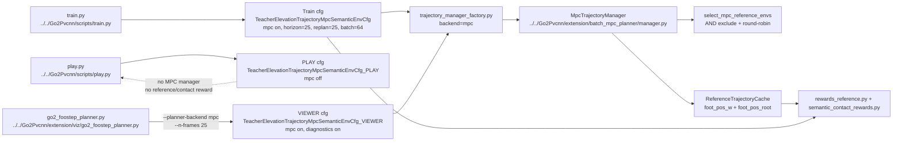

# Human MPC Planner Commands

## 导航

- 文档类型：`human` MPC planner 训练 / viewer / play 命令指南
- 对应 AI 文档：暂无
- 上一篇：[human-11-extension-trajectory-reward.md](human-11-extension-trajectory-reward.md)
- 下一篇：[human-13-batched-planner-swing-stance-ik-complexity.md](human-13-batched-planner-swing-stance-ik-complexity.md)
- 总索引：[../index.md](../index.md)

## 适用范围

这篇只覆盖当前 MPC semantic trajectory 主线：

- 训练入口：[../../Go2Pvcnn/scripts/train.py](../../Go2Pvcnn/scripts/train.py)
- 回放入口：[../../Go2Pvcnn/scripts/play.py](../../Go2Pvcnn/scripts/play.py)
- viewer 入口：[../../Go2Pvcnn/extension/viz/go2_foostep_planner.py](../../Go2Pvcnn/extension/viz/go2_foostep_planner.py)
- MPC manager：[../../Go2Pvcnn/extension/batch_mpc_planner/manager.py](../../Go2Pvcnn/extension/batch_mpc_planner/manager.py)
- MPC participation selector：[../../Go2Pvcnn/extension/batch_mpc_planner/participation.py](../../Go2Pvcnn/extension/batch_mpc_planner/participation.py)
- 真实语义 contact reward：[../../Go2Pvcnn/extension/mdp/semantic_contact_rewards.py](../../Go2Pvcnn/extension/mdp/semantic_contact_rewards.py)
- 近场腿部避障 reward：[../../Go2Pvcnn/extension/mdp/semantic_body_part_clearance.py](../../Go2Pvcnn/extension/mdp/semantic_body_part_clearance.py)

当前主线实验名：

- `teacher_elevation_trajectory_mpc_semantic`
- `teacher_elevation_trajectory_mpc_semantic_flat_small_avoidance`

当前 Gym id：

- 训练：`Isaac-Teacher-Elevation-Trajectory-Mpc-Semantic-Go2-v0`
- 回放：`Isaac-Teacher-Elevation-Trajectory-Mpc-Semantic-Go2-Play-v0`
- 平地小障碍避障训练：`Isaac-Teacher-Elevation-Trajectory-Mpc-Semantic-Flat-Small-Avoidance-Go2-v0`
- 平地小障碍避障回放：`Isaac-Teacher-Elevation-Trajectory-Mpc-Semantic-Flat-Small-Avoidance-Go2-Play-v0`

当前任务 cfg：

- [../../Go2Pvcnn/go2_pvcnn/tasks/teacher_elevation_trajectory_mpc_semantic_env_cfg.py](../../Go2Pvcnn/go2_pvcnn/tasks/teacher_elevation_trajectory_mpc_semantic_env_cfg.py)

## 配置归属

同一个任务文件里现在有三类 cfg，不能混用：

| cfg | 使用入口 | MPC | 用途 |
| --- | --- | --- | --- |
| `TeacherElevationTrajectoryMpcSemanticEnvCfg` | `scripts/train.py` / Gym 训练 id | 开启 | 正式 RL 训练；MPC reference cache、world-frame foot reward、semantic contact reward 都参与训练。 |
| `TeacherElevationTrajectoryMpcSemanticEnvCfg_PLAY` | `scripts/play.py` / Gym Play id | 关闭 | 普通 policy checkpoint 回放；不 attach MPC trajectory manager，不启用 `reference_foot_pos` 和 `semantic_contact_collision` reward。 |
| `TeacherElevationTrajectoryMpcSemanticEnvCfg_VIEWER` | `extension/viz/go2_foostep_planner.py` | 开启 | 交互/诊断 viewer；保留 MPC 规划、marker、runtime diagnostics 和低矮障碍物调试行为。 |
| `TeacherElevationTrajectoryMpcSemanticFlatSmallAvoidanceEnvCfg` | `scripts/train.py` / flat-small Gym 训练 id | 开启 | 从现有 teacher checkpoint 继续训练平地小障碍避障；保留原 observation/action shape，新增 `semantic_body_part_clearance` reward，并把小障碍 curriculum 改为 episode-level 成功门。 |
| `TeacherElevationTrajectoryMpcSemanticFlatSmallAvoidanceEnvCfg_PLAY` | `scripts/play.py` / flat-small Gym Play id | 关闭 | 回放 flat-small 训练出的 policy；不 attach MPC，不启用 reference/contact reward。 |

当前训练 cfg 的关键合同：

- `planner_backend = "mpc"`
- `planner_owned_reference_cache = True`
- `use_batched_reference_trajectory = True`
- `mpc_planner_cfg.runtime.horizon_steps = 25`
- `mpc_planner_cfg.runtime.replan_interval_steps = 25`
- `mpc_planner_cfg.runtime.dt = 0.02`
- `mpc_planner_cfg.runtime.parallel_plan_batch_size = 64`，可由 `train.py --mpc_num_envs <N>` 覆盖。
- `mpc_planner_cfg.reference_participation.exclude_pairs` 是黑名单 AND 逻辑：同时满足 terrain name 和 terrain row 的 env 不参与 MPC 抽签，只满足其中一个条件仍可参与。
- `reference_foot_pos_reward()` 使用 world-frame foot tracking。
- 语义碰撞训练默认不再加载全局 `semantic_contact_small/large`，而是由普通 `contact_forces` + 0.01m semantic/elevation map 推断，并合入 `semantic_body_part_clearance`。

flat-small avoidance 训练 cfg 额外合同：

- `experiment_name = "teacher_elevation_trajectory_mpc_semantic_flat_small_avoidance"`
- 只使用 flat terrain。
- `semantic_obstacle_curriculum.plane_counts` 的 small 数量是 `8,16,24,32,40,48,56,64,72,80`，large 全部是 `0`。
- 新增 reward `semantic_body_part_clearance`，使用当前 IsaacLab 的 `foot/calf/thigh` body pose 查询 scanner 缓存的 semantic/elevation map。
- 近场腿部避障 reward 直接读取当前 IsaacLab `semantic_height_scanner.data.elevation_map/semantic_map`，并用和 MPC 一致的 terrain query helper 按当前 scanner pose 查询；不再维护 reward 私有的地图 root anchor 缓存。
- curriculum 使用普通 `contact_forces` + 0.01m semantic/elevation map 推断 episode-level 小障碍碰撞记录；只有完整 timeout episode 且没有 small collision、base contact、bad orientation 才算成功。
- 训练 cfg 仍然需要 MPC trajectory manager，因为继承了 `reference_foot_pos` reward；`trajectory_manager_factory.py` 已允许这个新 experiment attach manager。

当前 PLAY cfg 的关键合同：

- `planner_owned_reference_cache = False`
- `use_batched_reference_trajectory = False`
- `rewards.reference_foot_pos = None`
- `rewards.semantic_contact_collision = None`
- `scene.semantic_contact_small = None`
- `scene.semantic_contact_large = None`
- `TeacherElevationTrajectoryMpcSemanticFlatSmallAvoidanceEnvCfg_PLAY` 还会关闭训练侧 `curriculum.terrain_levels`，因为 PLAY 场景不挂载 `semantic_contact_small/large`，不能执行依赖真实 contact sensor 的训练 curriculum。
- `terminations.time_out = None`，所以 PLAY 可视化不会因为 episode 到时自动 reset/刷新；仍保留 `base_contact` 和 `bad_orientation` 这类安全终止。

当前 VIEWER cfg 的关键合同：

- 继承 PLAY 的观测 / action / scanner 播放设置。
- 恢复 `planner_owned_reference_cache = True` 和 `use_batched_reference_trajectory = True`。
- 恢复 `reference_foot_pos` 和 `semantic_contact_collision`。
- 恢复 `semantic_contact_small` 和 `semantic_contact_large`。
- `mpc_planner_cfg.runtime.parallel_plan_batch_size = 4096`。
- `mpc_planner_cfg.diagnostics.emit_runtime_counters = True`。
- `mpc_planner_cfg.diagnostics.profile_cuda_sync = True`。

`train.py` 的 `--planner-backend` 当前只支持 `mpc`，默认也是 `mpc`。实际训练命令仍建议显式写 `--planner-backend mpc`，防止复制到其它 trajectory 实验时语义不清。

`play.py` 现在是普通 policy playback 路线。不要把 `play.py` 当 MPC viewer 用；需要看 MPC 足端规划、marker 或 low-small 诊断时，使用 `go2_foostep_planner.py`。

## Mermaid 命令入口图



## 环境前提

从仓库根目录运行：

```bash
cd /mnt/mydisk/lhy/testPvcnnWithIsaacsim
```

使用 IsaacLab / IsaacSim conda 环境：

```bash
/mnt/mydisk/lhy/anaconda3/envs/env_isaacsim/bin/python
```

单卡运行时用 `CUDA_VISIBLE_DEVICES` 选卡，例如：

```bash
CUDA_VISIBLE_DEVICES=0 /mnt/mydisk/lhy/anaconda3/envs/env_isaacsim/bin/python ...
```

不要用 `base` 环境跑训练、viewer 或真实 IsaacLab smoke。

## 训练命令

最小 headless smoke：

```bash
CUDA_VISIBLE_DEVICES=0 /mnt/mydisk/lhy/anaconda3/envs/env_isaacsim/bin/python Go2Pvcnn/scripts/train.py \
  --headless \
  --device cuda:0 \
  --num_envs 32 \
  --max_iterations 1 \
  --experiment teacher_elevation_trajectory_mpc_semantic \
  --planner-backend mpc
```

1024 env / 64 MPC env 验收训练入口：

```bash
CUDA_VISIBLE_DEVICES=0 /mnt/mydisk/lhy/anaconda3/envs/env_isaacsim/bin/python Go2Pvcnn/scripts/train.py \
  --headless \
  --device cuda:0 \
  --num_envs 1024 \
  --mpc_num_envs 64 \
  --max_iterations 1 \
  --experiment teacher_elevation_trajectory_mpc_semantic \
  --planner-backend mpc
```

常用单卡训练：

```bash
CUDA_VISIBLE_DEVICES=0 /mnt/mydisk/lhy/anaconda3/envs/env_isaacsim/bin/python Go2Pvcnn/scripts/train.py \
  --headless \
  --device cuda:0 \
  --num_envs 1024 \
  --mpc_num_envs 64 \
  --max_iterations 5000 \
  --experiment teacher_elevation_trajectory_mpc_semantic \
  --planner-backend mpc
```

## 平地小障碍避障训练命令

新任务使用这个 experiment：

```text
teacher_elevation_trajectory_mpc_semantic_flat_small_avoidance
```

最小 headless smoke：

```bash
CUDA_VISIBLE_DEVICES=0 /mnt/mydisk/lhy/anaconda3/envs/env_isaacsim/bin/python Go2Pvcnn/scripts/train.py \
  --headless \
  --device cuda:0 \
  --num_envs 16 \
  --max_iterations 1 \
  --experiment teacher_elevation_trajectory_mpc_semantic_flat_small_avoidance \
  --planner-backend mpc
```

从已经训练好的 teacher 模型继续训练：

```bash
CUDA_VISIBLE_DEVICES=0 /mnt/mydisk/lhy/anaconda3/envs/env_isaacsim/bin/python Go2Pvcnn/scripts/train.py \
  --headless \
  --device cuda:0 \
  --num_envs 1024 \
  --max_iterations 5000 \
  --experiment teacher_elevation_trajectory_mpc_semantic_flat_small_avoidance \
  --planner-backend mpc \
  --resume \
  --load_run /mnt/mydisk/lhy/testPvcnnWithIsaacsim/logs/rsl_rl/teacher_elevation_trajectory_mpc_semantic/2026-06-04_18-16-07 \
  --load_checkpoint model_14000.pt
```

短训 / 调参时可以先用较小 env 数：

```bash
CUDA_VISIBLE_DEVICES=0 /mnt/mydisk/lhy/anaconda3/envs/env_isaacsim/bin/python Go2Pvcnn/scripts/train.py \
  --headless \
  --device cuda:0 \
  --num_envs 256 \
  --max_iterations 200 \
  --experiment teacher_elevation_trajectory_mpc_semantic_flat_small_avoidance \
  --planner-backend mpc \
  --resume \
  --load_run /mnt/mydisk/lhy/testPvcnnWithIsaacsim/logs/rsl_rl/teacher_elevation_trajectory_mpc_semantic/2026-06-04_18-16-07 \
  --load_checkpoint model_14000.pt
```

继续当前 flat-small run 的 `model_14700.pt`，并让 RL 环境数量和 MPC 数量一致：

```bash
CUDA_VISIBLE_DEVICES=1 /mnt/mydisk/lhy/anaconda3/envs/env_isaacsim/bin/python Go2Pvcnn/scripts/train.py \
  --headless \
  --device cuda:0 \
  --num_envs 1024 \
  --mpc_num_envs 1024 \
  --max_iterations 5000 \
  --experiment teacher_elevation_trajectory_mpc_semantic_flat_small_avoidance \
  --planner-backend mpc \
  --resume \
  --load_run /mnt/mydisk/lhy/testPvcnnWithIsaacsim/logs/rsl_rl/teacher_elevation_trajectory_mpc_semantic_flat_small_avoidance/2026-06-17_12-01-10 \
  --load_checkpoint model_14700.pt \
  --keep_std
```

注意：

- 这里 `--load_run` 用绝对路径，是因为 warm-start checkpoint 在旧 experiment 目录下，而新训练输出会写到 `logs/rsl_rl/teacher_elevation_trajectory_mpc_semantic_flat_small_avoidance/<timestamp>/`。
- 旧 run 里如果没有 `model_最新.pt`，必须显式写 `--load_checkpoint model_14000.pt` 或其它真实存在的 checkpoint。
- 这个 warm start 已做过 16 env / 1 iteration smoke，policy/critic/action shape 与旧模型兼容。
- 默认 resume 会丢掉 checkpoint 里的 policy action `std`，回到当前初始化值；如果要继续使用旧 checkpoint 学到的探索噪声，需要显式加 `--keep_std`。
- `--mpc_num_envs 1024` 会把 MPC 每次 replan 的采样环境数设为 1024；1024 RL env / 1024 MPC env 路径已经通过显存和短步数验证，但长训仍要观察 collection time。

分布式训练：

```bash
GPU_IDS=0,1 /mnt/mydisk/lhy/anaconda3/envs/env_isaacsim/bin/python -m torch.distributed.run \
  --standalone \
  --nnodes=1 \
  --nproc_per_node=2 \
  Go2Pvcnn/scripts/train.py \
  --distributed \
  --headless \
  --num_envs 2048 \
  --max_iterations 5000 \
  --experiment teacher_elevation_trajectory_mpc_semantic \
  --planner-backend mpc
```

这里 `--num_envs` 按总 env 数写，脚本会按 `WORLD_SIZE` 分配到每张卡。

恢复训练：

```bash
CUDA_VISIBLE_DEVICES=0 /mnt/mydisk/lhy/anaconda3/envs/env_isaacsim/bin/python Go2Pvcnn/scripts/train.py \
  --headless \
  --device cuda:0 \
  --experiment teacher_elevation_trajectory_mpc_semantic \
  --planner-backend mpc \
  --resume \
  --load_run 2026-05-30_00-00-00 \
  --load_checkpoint model_0.pt
```

打印 planner / reward timing 诊断：

```bash
T302G_STEP_TIMING_STEPS=5 CUDA_VISIBLE_DEVICES=0 /mnt/mydisk/lhy/anaconda3/envs/env_isaacsim/bin/python Go2Pvcnn/scripts/train.py \
  --headless \
  --device cuda:0 \
  --num_envs 1024 \
  --max_iterations 1 \
  --experiment teacher_elevation_trajectory_mpc_semantic \
  --planner-backend mpc \
  --verbose-planner
```

## Viewer 命令

MPC semantic task headless scripted smoke：

```bash
CUDA_VISIBLE_DEVICES=0 timeout -s INT -k 20s 90s /mnt/mydisk/lhy/anaconda3/envs/env_isaacsim/bin/python \
  Go2Pvcnn/extension/viz/go2_foostep_planner.py \
  --headless \
  --device cuda:0 \
  --num_envs 1 \
  --terrain task \
  --planner-backend mpc \
  --n-frames 25 \
  --plan-dt 0.02 \
  --warmup-steps 0 \
  --scripted-command "0.20 0.00 0.00" \
  --scripted-command-cycles 1
```

本地交互 viewer：

```bash
CUDA_VISIBLE_DEVICES=0 /mnt/mydisk/lhy/anaconda3/envs/env_isaacsim/bin/python Go2Pvcnn/extension/viz/go2_foostep_planner.py \
  --device cuda:0 \
  --num_envs 1 \
  --terrain task \
  --planner-backend mpc \
  --n-frames 25 \
  --plan-dt 0.02
```

远程 WebRTC viewer：

```bash
CUDA_VISIBLE_DEVICES=2 /mnt/mydisk/lhy/anaconda3/envs/env_isaacsim/bin/python Go2Pvcnn/extension/viz/go2_foostep_planner.py \
  --headless \
  --livestream 2 \
  --webrtc-public-ip 172.31.179.75 \
  --device cuda:0 \
  --num_envs 1 \
  --terrain task \
  --planner-backend mpc \
  --n-frames 25 \
  --plan-dt 0.02
```

远程服务器上 `--webrtc-public-ip` 要填浏览器能访问到的服务器地址；不填时 viewer 会优先使用 `PUBLIC_IP`，再尝试从 `SSH_CONNECTION` 推断服务器 IP。默认 WebRTC port 是 `49100`；需要换端口时用 `--webrtc-port <port>`。

viewer 默认连续播放，不需要 `--step-mode`。运行时在终端按 `M` 进入单帧模式，再按 `M` 回连续播放。单帧模式下，每按一次空格只推进一次机器狗状态，并在同一节拍更新轨迹 marker；不按空格时 IsaacLab/Kit 窗口仍持续 render/pump。`W/A/S/D/Q/E/R` 仍监听。运动命令会锁存为下一段轨迹输入，当前轨迹未播放完时不会中途切换轨迹；`R` 仍即时 reset。

teleop 键位：

- `W/S`：前后速度
- `A/D`：横向速度
- `Q/E`：偏航速度
- `X`：清零命令
- `R`：reset，并触发重规划

## MPC Policy Eval 命令

`mpc_policy_eval.py` 是专门的评估入口，不是普通 `play.py` 回放。它会加载 policy checkpoint，同时启用 MPC reference/cache，用来跑两类测试：

- `tracking`：对比 policy 实际足端轨迹和 MPC reference foot 轨迹。
- `small_collision`：在平地小语义障碍物场景统计碰撞率；每轮里每个 env 只要发生过一次小障碍物碰撞就计 1，分母是 `num_envs`，不是 step 数。

tracking headless：

```bash
CUDA_VISIBLE_DEVICES=0 PYTHONUNBUFFERED=1 timeout 300s \
  /mnt/mydisk/lhy/anaconda3/envs/env_isaacsim/bin/python Go2Pvcnn/scripts/mpc_policy_eval.py \
  --mode tracking \
  --headless \
  --device cuda:0 \
  --num-envs 4 \
  --num-rounds 1 \
  --max-steps 20 \
  --run-dir 2026-05-31_20-03-27 \
  --checkpoint model_14000.pt \
  --terrain-rows 0 \
  --terrain-cols 0 \
  --command-mode fixed \
  --command "0.4 0.0 0.0" \
  --output-dir logs/mpc_policy_eval/tracking_smoke
```

small_collision headless：

```bash
CUDA_VISIBLE_DEVICES=0 PYTHONUNBUFFERED=1 timeout 300s \
  /mnt/mydisk/lhy/anaconda3/envs/env_isaacsim/bin/python Go2Pvcnn/scripts/mpc_policy_eval.py \
  --mode small_collision \
  --headless \
  --device cuda:0 \
  --num-envs 4 \
  --num-rounds 1 \
  --max-steps 20 \
  --run-dir 2026-05-31_20-03-27 \
  --checkpoint model_14000.pt \
  --command-mode random \
  --random-command-interval 5 \
  --small-count-per-tile 80 \
  --output-dir logs/mpc_policy_eval/small_collision_smoke
```

flat-small avoidance 的 small-collision 行为评估：

```bash
CUDA_VISIBLE_DEVICES=0 PYTHONUNBUFFERED=1 timeout 600s \
  /mnt/mydisk/lhy/anaconda3/envs/env_isaacsim/bin/python Go2Pvcnn/scripts/mpc_policy_eval.py \
  --mode small_collision \
  --headless \
  --device cuda:0 \
  --num-envs 100 \
  --num-rounds 5 \
  --max-steps 2000 \
  --run-dir <flat-small-run-dir> \
  --checkpoint <checkpoint.pt> \
  --command-mode fixed \
  --command "1.0 0.0 0.0" \
  --small-count-per-tile 80 \
  --output-dir logs/mpc_policy_eval/flat_small_avoidance_smoke
```

当前 caveat：`mpc_policy_eval.py` 的 checkpoint lookup 仍默认从 `logs/rsl_rl/teacher_elevation_trajectory_mpc_semantic/<run-dir>/` 查找。评估 flat-small 新 experiment 训练出的 checkpoint 前，需要先确认 eval 脚本已支持 flat-small experiment 路径，或者临时把目标 checkpoint 放到它当前查找的目录结构下。这个 caveat 只影响 eval 脚本，不影响 `train.py` 和 `play.py`。

可视化 / livestream tracking：

```bash
CUDA_VISIBLE_DEVICES=0 PYTHONUNBUFFERED=1 timeout 300s \
  /mnt/mydisk/lhy/anaconda3/envs/env_isaacsim/bin/python Go2Pvcnn/scripts/mpc_policy_eval.py \
  --mode tracking \
  --livestream 2 \
  --device cuda:0 \
  --num-envs 1 \
  --num-rounds 1 \
  --max-steps 2 \
  --run-dir 2026-05-31_20-03-27 \
  --checkpoint model_14000.pt \
  --command-mode fixed \
  --command "0.4 0.0 0.0" \
  --output-dir logs/mpc_policy_eval/visual_tracking_smoke
```

eval 侧关键参数：

- `--num-rounds`：测试轮数。
- `--max-steps`：每轮步数，执行完 `max_steps` 算一轮。
- `--mode tracking`：输出 policy-vs-MPC 足端 tracking 指标。
- `--mode small_collision`：输出小语义障碍物 env-rate 碰撞指标。
- `--command-mode fixed|random|sweep`：控制 policy 和 MPC 共用的 body-frame 速度命令。
- `--small-count-per-tile`：small_collision 平地小语义物体密度。
- `--collision-force-threshold`：判定小障碍物碰撞的 contact force 阈值，默认 `1.0`。
- `--terrain-rows/--terrain-cols`：当前用于 eval terrain grid 配置；它还不是严格的原始 terrain row/col ID selector，正式多地形对比前需要先修这个语义。

## Play 命令

基础回放：

```bash
CUDA_VISIBLE_DEVICES=0 /mnt/mydisk/lhy/anaconda3/envs/env_isaacsim/bin/python Go2Pvcnn/scripts/play.py \
  --experiment teacher_elevation_trajectory_mpc_semantic \
  --run_dir 2026-05-30_00-00-00 \
  --checkpoint model_0.pt \
  --num_envs 1 \
  --device cuda:0
```

短视频 smoke：

```bash
CUDA_VISIBLE_DEVICES=0 /mnt/mydisk/lhy/anaconda3/envs/env_isaacsim/bin/python Go2Pvcnn/scripts/play.py \
  --headless \
  --device cuda:0 \
  --num_envs 1 \
  --experiment teacher_elevation_trajectory_mpc_semantic \
  --run_dir 2026-05-30_00-00-00 \
  --checkpoint model_0.pt \
  --video \
  --video_length 1 \
  --video_interval 1
```

远程 WebRTC 回放：

```bash
CUDA_VISIBLE_DEVICES=0 /mnt/mydisk/lhy/anaconda3/envs/env_isaacsim/bin/python Go2Pvcnn/scripts/play.py \
  --experiment teacher_elevation_trajectory_mpc_semantic \
  --run_dir 2026-05-31_20-03-27 \
  --checkpoint model_19800.pt \
  --num_envs 1 \
  --headless \
  --livestream 2 \
  --device cuda:0
```

step-mode policy 回放：

```bash
CUDA_VISIBLE_DEVICES=0 /mnt/mydisk/lhy/anaconda3/envs/env_isaacsim/bin/python Go2Pvcnn/scripts/play.py \
  --experiment teacher_elevation_trajectory_mpc_semantic \
  --run_dir 2026-05-30_00-00-00 \
  --checkpoint model_0.pt \
  --num_envs 1 \
  --headless \
  --livestream 2 \
  --device cuda:0 \
  --step-mode
```

play 侧 `--step-mode` 需要显式开启；启用后每按一次空格推进一个 policy/env step，不按空格时仍保持 IsaacLab/Kit 窗口 render/pump。

headless policy smoke 示例：

```bash
CUDA_VISIBLE_DEVICES=0 PYTHONUNBUFFERED=1 timeout 240s /mnt/mydisk/lhy/anaconda3/envs/env_isaacsim/bin/python Go2Pvcnn/scripts/play.py \
  --headless \
  --device cuda:0 \
  --num_envs 1 \
  --experiment teacher_elevation_trajectory_mpc_semantic \
  --run_dir 2026-05-31_20-03-27 \
  --checkpoint model_14000.pt \
  --max-steps 5 \
  --debug-livestream
```

这个 smoke 应该看到：

```text
[Policy] Loaded successfully
Starting Play Loop
Play Complete - Timesteps: 5
```

并且不应该出现：

```text
[Planner] Attached ... trajectory manager
```

回放 flat-small avoidance 训练出的模型：

```bash
CUDA_VISIBLE_DEVICES=0 /mnt/mydisk/lhy/anaconda3/envs/env_isaacsim/bin/python Go2Pvcnn/scripts/play.py \
  --headless \
  --device cuda:0 \
  --num_envs 1 \
  --experiment teacher_elevation_trajectory_mpc_semantic_flat_small_avoidance \
  --run_dir <flat-small-run-dir> \
  --checkpoint <checkpoint.pt> \
  --max-steps 200 \
  --debug-livestream
```

这里 `<flat-small-run-dir>` 是新 experiment 目录下的 timestamp，例如：

```text
logs/rsl_rl/teacher_elevation_trajectory_mpc_semantic_flat_small_avoidance/<flat-small-run-dir>/<checkpoint.pt>
```

flat-small PLAY 指定 env0 初始子地形：

```bash
CUDA_VISIBLE_DEVICES=2 /mnt/mydisk/lhy/anaconda3/envs/env_isaacsim/bin/python Go2Pvcnn/scripts/play.py \
  --headless \
  --device cuda:0 \
  --num_envs 1 \
  --experiment teacher_elevation_trajectory_mpc_semantic_flat_small_avoidance \
  --run_dir 2026-06-12_19-05-27 \
  --checkpoint model_28900.pt \
  --terrain-row 3 \
  --terrain-col 0 \
  --max-steps 200
```

这个命令会把 env0 的 `terrain_levels[0]` / `terrain_types[0]` / `terrain.env_origins[0]` / `scene.env_origins[0]` 同步到指定 row/col。启动日志应看到：

```text
[play.py] Initial terrain env0: row=3, col=0
[INFO] Curriculum Manager:  <CurriculumManager> contains 0 active terms.
```

flat-small PLAY 键盘速度控制：

```bash
CUDA_VISIBLE_DEVICES=2 /mnt/mydisk/lhy/anaconda3/envs/env_isaacsim/bin/python Go2Pvcnn/scripts/play.py \
  --livestream 2 \
  --device cuda:0 \
  --num_envs 1 \
  --experiment teacher_elevation_trajectory_mpc_semantic_flat_small_avoidance \
  --run_dir 2026-06-12_19-05-27 \
  --checkpoint model_28900.pt \
  --terrain-row 3 \
  --terrain-col 0 \
  --keyboard-control \
  --keyboard-linear-speed 0.5 \
  --keyboard-lateral-speed 0.25 \
  --keyboard-yaw-speed 0.5
```

键盘控制语义：

- `W/S`：前进 / 后退 body-frame `lin_vel_x`
- `A/D`：左 / 右 body-frame `lin_vel_y`
- `Q/E`：左转 / 右转 `ang_vel_z`
- `+/-`：同时调大 / 调小线速度、横向速度、转向速度上限
- `Space` 或 `X`：清零当前按住命令
- `Esc`：停止终端键盘读取线程

`play.py` 现在不再使用 `pynput`。`--keyboard-control` 会直接从启动命令的终端读取键盘输入：主线程继续跑 policy/env step 和 livestream，后台线程把终端切到 cbreak 模式并用 `select` 非阻塞读取 stdin。

注意：这个功能要求启动 `play.py` 的 stdin 是一个真实 TTY。也就是你需要在 SSH 终端里直接运行命令；如果命令是被非交互工具、管道、后台服务或没有 TTY 的调度器启动，脚本会打印 `stdin is not a TTY` 并自动禁用键盘控制，但不会崩。

terminal 模式没有系统级 key release event，所以实现采用“短时保持”语义：收到一次 `W/A/S/D/Q/E` 后维持约 `0.15s`；你按住键时终端自动重复发键，命令会持续；松开后超过保持时间就自动归零。这适合 livestream：浏览器负责看画面，SSH 终端负责给速度。

如果只是想看旧 teacher 模型本身，仍然用：

```bash
CUDA_VISIBLE_DEVICES=0 /mnt/mydisk/lhy/anaconda3/envs/env_isaacsim/bin/python Go2Pvcnn/scripts/play.py \
  --headless \
  --device cuda:0 \
  --num_envs 1 \
  --experiment teacher_elevation_trajectory_mpc_semantic \
  --run_dir 2026-06-04_18-16-07 \
  --checkpoint model_14000.pt \
  --max-steps 200
```

## 关键参数解释

训练 / play 侧：

- `--experiment teacher_elevation_trajectory_mpc_semantic`
  进入 MPC + semantic grid trajectory reward 训练 / 回放路径。
- `--experiment teacher_elevation_trajectory_mpc_semantic_flat_small_avoidance`
  进入平地小障碍避障 continuation 路径；训练时保留 MPC reference reward，并额外启用近场 body-part clearance reward。
- `--planner-backend mpc`
  训练侧使用 [../../Go2Pvcnn/extension/batch_mpc_planner](../../Go2Pvcnn/extension/batch_mpc_planner)。普通 `play.py` 现在不依赖这个参数启动 MPC。
- `--num_envs`
  并行环境数。当前 1024 env / 64 MPC env 已通过 25-step probe 和 1-iteration train entry。
- `--max_iterations`
  PPO 训练迭代数。连通性验证常用 `1`，正式训练可用 `5000`。
- `--distributed`
  启用多卡训练。分布式模式下 WebRTC livestream 会被脚本关闭。
- `--headless`
  无本地 GUI。
- `--device`
  IsaacLab / torch device，通常用 `cuda:0`。如果使用 `CUDA_VISIBLE_DEVICES=2`，进程内仍通常写 `--device cuda:0`。
- `--resume / --load_run / --load_checkpoint`
  恢复已有 run。
- `--keep_std`
  只在 `--resume` 时有意义。默认 resume 会移除 checkpoint 里的 actor `std` 并使用当前初始化 action noise；加上 `--keep_std` 后会保留 checkpoint 里的旧 `std`。继续 `2026-06-17_12-01-10/model_14700.pt` 时，如果不希望 std 回到 1，就加这个参数。
- `--mpc_num_envs`
  覆盖 `mpc_planner_cfg.runtime.parallel_plan_batch_size`，控制每次 MPC replan 采样多少个环境。希望 RL env 数和 MPC env 数一致时，例如 `--num_envs 1024 --mpc_num_envs 1024`。
- `--verbose-planner`
  训练侧 planner timing 诊断，默认关闭。

viewer 侧：

- `--terrain task`
  使用 semantic MPC task terrain / scanner / reward cfg。
- `--planner-backend mpc`
  viewer attach 任务 manager，并通过 MPC backend 规划。
- `--n-frames 25`
  MPC horizon。当前训练和 viewer 都按 25 帧对齐。
- `--plan-dt 0.02`
  MPC 时间步长。
- `--warmup-steps`
  viewer 启动后零动作 warmup 步数。
- `--scripted-command "vx vy yaw_rate"`
  非交互 headless 诊断用固定速度命令。
- `--scripted-command-cycles`
  scripted command 保持的重规划 cycle 数。
- `--livestream`
  Isaac Sim WebRTC 模式，通常用 `2`。
- `--webrtc-public-ip`
  远程 WebRTC 对外地址。服务器远程浏览器黑屏时优先显式设置它，避免 IsaacLab 默认广告 `127.0.0.1`。
- `--webrtc-port`
  WebRTC livestream 端口，默认 `49100`。

env cfg 侧关键字段：

- `TeacherElevationTrajectoryMpcSemanticEnvCfg.planner_backend = "mpc"`
- `TeacherElevationTrajectoryMpcSemanticEnvCfg.planner_owned_reference_cache = True`
- `TeacherElevationTrajectoryMpcSemanticEnvCfg.use_batched_reference_trajectory = True`
- `TeacherElevationTrajectoryMpcSemanticEnvCfg.mpc_planner_cfg.runtime.horizon_steps = 25`
- `TeacherElevationTrajectoryMpcSemanticEnvCfg.mpc_planner_cfg.runtime.replan_interval_steps = 25`
- `TeacherElevationTrajectoryMpcSemanticEnvCfg.mpc_planner_cfg.runtime.dt = 0.02`
- `TeacherElevationTrajectoryMpcSemanticEnvCfg.mpc_planner_cfg.runtime.parallel_plan_batch_size = 64`
- `reference_height_scanner_name = "semantic_height_scanner"`
- `semantic_contact_collision` reward 使用 `semantic_contact_small` / `semantic_contact_large` 两个全局 sensor。
- `TeacherElevationTrajectoryMpcSemanticEnvCfg_PLAY` 会关闭 MPC/reference/contact reward，并关闭 timeout 自动刷新。
- `TeacherElevationTrajectoryMpcSemanticEnvCfg_VIEWER` 会重新开启 MPC/reference/contact，并把 viewer 诊断 batch 调到 `4096`。
- `TeacherElevationTrajectoryMpcSemanticFlatSmallAvoidanceEnvCfg` 继承主训练 cfg，保持 observation/action ABI，额外启用 flat-only terrain、小障碍数量 curriculum、`semantic_body_part_clearance` reward、episode-level small collision gate。
- `TeacherElevationTrajectoryMpcSemanticFlatSmallAvoidanceEnvCfg_PLAY` 继承 flat-small cfg 的回放环境，但关闭 MPC/reference/contact reward、训练 curriculum 和 timeout 自动刷新，用于 policy playback。

这些字段主要在：

- [../../Go2Pvcnn/go2_pvcnn/tasks/teacher_elevation_trajectory_mpc_semantic_env_cfg.py](../../Go2Pvcnn/go2_pvcnn/tasks/teacher_elevation_trajectory_mpc_semantic_env_cfg.py)

## 当前已验证证据

截至 `2026-06-10` 的验证：

- focused local tests：`7 passed`
- backend / parametric tests：`140 passed, 1 warning`
- real IsaacLab semantic contact smoke：PASS
- 1024 env / 64 MPC env 25-step probe：`5.256s`
- real train entry：`1024 env`, `--max_iterations 1`, `--planner-backend mpc`，退出码 `0`
- low-small full matrix：`20` rows，`12` crossing-covered rows，FK semantic collision `0`，max crossing FK error `0.0634m`
- PLAY / VIEWER split：PLAY headless 使用 `model_14000.pt` 完成 `5` steps，且没有 attach MPC trajectory manager。
- PLAY / VIEWER split 后 low-small 回归：`5` rows，`2` crossing-covered rows，FK semantic collision `0`，max crossing FK error `0.0416m`
- flat-small avoidance focused local regression：`31 passed`
- flat-small avoidance production `py_compile`：exit `0`
- flat-small avoidance fresh train smoke：16 env / 1 iteration，exit `0`
- flat-small avoidance 从 `2026-06-04_18-16-07/model_14000.pt` resume smoke：16 env / 1 iteration，exit `0`

记录：

- [../log/2026-05-30-2103-t302l-semantic-contact-smoke.md](../log/2026-05-30-2103-t302l-semantic-contact-smoke.md)
- [../log/2026-05-30-2114-t302l-rl-1024-64-performance.md](../log/2026-05-30-2114-t302l-rl-1024-64-performance.md)
- [../log/2026-05-30-2123-t302l-final-verification.md](../log/2026-05-30-2123-t302l-final-verification.md)
- [../log/2026-06-02-0006-t302l-play-viewer-cfg-split.md](../log/2026-06-02-0006-t302l-play-viewer-cfg-split.md)
- [../log/2026-06-10-2035-t302q-flat-small-local-implementation-and-smoke.md](../log/2026-06-10-2035-t302q-flat-small-local-implementation-and-smoke.md)

已知 caveat：

- 如果看到 `Filter pattern '/World/semantic_course/small/*' did not match the correct number of entries` 或 large 版本，通常说明跑到了旧 per-body filtered contact sensor 路线，或没有用当前全局 semantic contact sensor 代码。

## 常见报错与第一检查点

`RuntimeError: No CUDA GPUs are available`

- 检查是否进了 `env_isaacsim`
- 检查 `--device` 和 `CUDA_VISIBLE_DEVICES`

`planner-owned reference cache requires env.unwrapped._trajectory_manager`

- 说明当前路径没有挂上 trajectory manager
- 对训练 cfg / viewer cfg 来说，这不是允许的正常路径
- 对 `TeacherElevationTrajectoryMpcSemanticEnvCfg_PLAY` / `scripts/play.py` 来说，普通回放本来就不挂 `_trajectory_manager`
- 对 `teacher_elevation_trajectory_mpc_semantic_flat_small_avoidance` 训练来说，也应该挂上 trajectory manager；如果报这个错，先检查 `extension/trajectory_manager_factory.py` 的 allowlist 是否包含 flat-small experiment。

`horizon_s must equal the fixed 1.0s contract`

- 说明当前命令没有走到 MPC backend
- 检查命令是否写了 `--planner-backend mpc`
- 检查 cfg 是否仍是 `planner_backend = "mpc"`

`argument --terrain: invalid choice`

- 当前 viewer 使用 `--terrain task`

viewer 能启动但看不到 scripted 命令效果：

- 检查是否传了 `--scripted-command "vx vy yaw_rate"`
- 检查 `--scripted-command-cycles` 是否大于 `0`
- 检查 stdout 是否有 MPC planner / manager attach 信息

## 建议使用顺序

1. 先跑 `32 env / 1 iteration` train smoke，确认 MPC semantic 训练路径能启动
2. 再跑 `1024 env / 1 iteration`，确认 64 MPC env participation 性能
3. 再跑 viewer scripted smoke，确认 `TeacherElevationTrajectoryMpcSemanticEnvCfg_VIEWER`、`--planner-backend mpc` 和 25 帧 horizon
4. 再跑正式单卡训练，例如 `1024 env / 5000 iterations`
5. 最后用 `play.py` 看训练出的 checkpoint 回放；这里检查 policy 能跑，不检查 MPC marker
