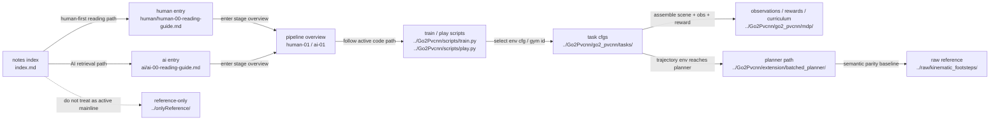

# TestPvcnnWithIsaacsim Notes Index

`notes/` 现在按当前仓库的真实工作主线组织，并且明确建立三种关系：

- 总索引关系：`notes/index.md` 是统一入口
- 横向对照关系：`human` 和 `ai` 文档按编号一一对应
- 纵向流程关系：每篇阶段文档都要能看出上一篇、下一篇、上游输入、下游消费者

## 强约束

- 每次在这个仓库开启新对话，必须先查看 `notes/index.md`
- 需要继续钻取时，优先从 `human-00` 或 `ai-00` 进入，而不是直接凭文件名猜测
- 所有知识库链接必须使用仓库内相对路径，便于服务器路径和本地 `Z:` 映射共用一套 Obsidian graph
- `raw/` 和 `onlyReference/` 默认是参考资料，不是当前项目主线

## Agent Memory Entry

- [调查 dashboard](todo.md)
- [branch memory 目录](todo/README.md)
- [验证日志索引](log/index.md)

进入具体任务前，先读 [todo.md](todo.md)，再按需继续读相关 branch page、相关 log，以及对应 `human/` 或 `ai/` 阶段文档。

## Mermaid 总入口图

## 阅读入口

如果你是第一次读这个仓库，推荐先走 `human` 主线：

1. [human/human-00-reading-guide.md](human/human-00-reading-guide.md)
2. [human/human-01-overall-pipeline.md](human/human-01-overall-pipeline.md)
3. [human/human-02-training-and-entrypoints.md](human/human-02-training-and-entrypoints.md)
4. [human/human-03-environment-and-observations.md](human/human-03-environment-and-observations.md)
5. [human/human-04-lidar-and-pvcnn.md](human/human-04-lidar-and-pvcnn.md)
6. [human/human-05-ppo-and-runner.md](human/human-05-ppo-and-runner.md)
7. [human/human-06-assets-paths-and-experiments.md](human/human-06-assets-paths-and-experiments.md)
8. [human/human-07-manual-tuning-guide.md](human/human-07-manual-tuning-guide.md)
9. [human/human-08-extension-planner-reading-guide.md](human/human-08-extension-planner-reading-guide.md)
10. [human/human-09-extension-planner-mapping.md](human/human-09-extension-planner-mapping.md)
11. [human/human-10-extension-planner-runtime.md](human/human-10-extension-planner-runtime.md)
12. [human/human-11-extension-trajectory-reward.md](human/human-11-extension-trajectory-reward.md)
13. [human/human-12-batched-planner-train-viewer-commands.md](human/human-12-batched-planner-train-viewer-commands.md)
14. [human/human-13-batched-planner-swing-stance-ik-complexity.md](human/human-13-batched-planner-swing-stance-ik-complexity.md)
15. [human/human-14-batched-planner-viewer-diagnostics-summary.md](human/human-14-batched-planner-viewer-diagnostics-summary.md)
16. [human/human-15-raw-kinematic-planner-and-trajectory-training-summary.md](human/human-15-raw-kinematic-planner-and-trajectory-training-summary.md)
17. [human/human-16-isaaclab-applauncher-webrtc-migration.md](human/human-16-isaaclab-applauncher-webrtc-migration.md)

如果你是为了检索入口、模块边界和输入输出，走 `ai` 主线：

1. [ai/ai-00-reading-guide.md](ai/ai-00-reading-guide.md)
2. [ai/ai-01-overall-pipeline.md](ai/ai-01-overall-pipeline.md)
3. [ai/ai-02-training-and-entrypoints.md](ai/ai-02-training-and-entrypoints.md)
4. [ai/ai-03-environment-and-observations.md](ai/ai-03-environment-and-observations.md)
5. [ai/ai-04-lidar-and-pvcnn.md](ai/ai-04-lidar-and-pvcnn.md)
6. [ai/ai-05-ppo-and-runner.md](ai/ai-05-ppo-and-runner.md)
7. [ai/ai-06-assets-paths-and-experiments.md](ai/ai-06-assets-paths-and-experiments.md)
8. [ai/ai-07-manual-tuning-reference.md](ai/ai-07-manual-tuning-reference.md)
9. [ai/ai-08-extension-planner-reading-guide.md](ai/ai-08-extension-planner-reading-guide.md)
10. [ai/ai-09-extension-planner-mapping.md](ai/ai-09-extension-planner-mapping.md)
11. [ai/ai-10-extension-planner-runtime.md](ai/ai-10-extension-planner-runtime.md)
12. [ai/ai-11-extension-trajectory-reward.md](ai/ai-11-extension-trajectory-reward.md)
13. [ai/ai-13-batched-planner-swing-stance-ik-complexity.md](ai/ai-13-batched-planner-swing-stance-ik-complexity.md)

## Human / AI 一一对照

| 编号 | Human | AI | 作用 |
| --- | --- | --- | --- |
| 00 | `human-00-reading-guide.md` | `ai-00-reading-guide.md` | 说明怎么读整套笔记 |
| 01 | `human-01-overall-pipeline.md` | `ai-01-overall-pipeline.md` | 给出项目总流程和主链 |
| 02 | `human-02-training-and-entrypoints.md` | `ai-02-training-and-entrypoints.md` | 训练、测试、播放入口与脚本分工 |
| 03 | `human-03-environment-and-observations.md` | `ai-03-environment-and-observations.md` | 任务配置、场景、观测与 curriculum |
| 04 | `human-04-lidar-and-pvcnn.md` | `ai-04-lidar-and-pvcnn.md` | LiDAR、ray caster、PVCNN 特征链 |
| 05 | `human-05-ppo-and-runner.md` | `ai-05-ppo-and-runner.md` | `rsl_rl` runner、PPO、同步 PVCNN 训练 |
| 06 | `human-06-assets-paths-and-experiments.md` | `ai-06-assets-paths-and-experiments.md` | 资产、权重、实验路径和目录边界 |
| 07 | `human-07-manual-tuning-guide.md` | `ai-07-manual-tuning-reference.md` | 手工调参入口和参数消费地址索引 |
| 08 | `human-08-extension-planner-reading-guide.md` | `ai-08-extension-planner-reading-guide.md` | extension planner 阅读入口 |
| 09 | `human-09-extension-planner-mapping.md` | `ai-09-extension-planner-mapping.md` | raw planner 到 extension planner 的映射 |
| 10 | `human-10-extension-planner-runtime.md` | `ai-10-extension-planner-runtime.md` | planner runtime、缓存与重规划 |
| 11 | `human-11-extension-trajectory-reward.md` | `ai-11-extension-trajectory-reward.md` | planner 参考轨迹奖励设计 |
| 12 | `human-12-batched-planner-train-viewer-commands.md` | 暂无 | train / viewer / play 命令与参数说明 |
| 13 | `human-13-batched-planner-swing-stance-ik-complexity.md` | `ai-13-batched-planner-swing-stance-ik-complexity.md` | batched planner：swing/stance、foothold、base、IK 语义与复杂度（单环境） |
| 14 | `human-14-batched-planner-viewer-diagnostics-summary.md` | 暂无 | viewer/runtime diagnostics、planner 输出证据与问题归因总结 |

## 阶段主链

`entry scripts`
-> `task/env config`
-> `observations + curriculum`
-> `height_scanner / semantic grids / optional PVCNN`
-> `PPO runner / training loop`
-> `checkpoints / assets / experiment outputs`

## 文档关系规则

- `00` 是阅读指南，负责说明怎么进入整套笔记
- `01` 是整体流程，负责把项目主线放到一张总图里
- `02-06` 是主链阶段文档，按仓库实际工作顺序排列
- `07` 是横向专题文档，负责手工调参、参数地址、消费位置串联
- `08-11` 是 planner 子线文档，负责 extension planner 的阅读入口、映射关系、运行时设计和奖励链路
- 其中 `09-11` 需要明确区分 `raw CPU kinematic`、当前 `extension/reference` 边界层、`batched pure GPU` 主线，以及它们和 Isaac Lab 的接口边界
- 每篇 `human` 文档都必须链接到对应 `ai` 文档
- 每篇 `ai` 文档都必须链接回对应 `human` 文档
- 每篇阶段文档都应该写清楚上一篇、下一篇、上游输入和下游消费者

## Planner 子线入口

如果任务涉及：

- `Go2Pvcnn/extension/reference`
- `teacher_elevation_trajectory`
- imitation reward
- `raw/kinematic_footsteps` 到 Isaac Lab planner 对齐

必须先从下面入口进入：

1. [human/human-08-extension-planner-reading-guide.md](human/human-08-extension-planner-reading-guide.md)
2. [human/human-09-extension-planner-mapping.md](human/human-09-extension-planner-mapping.md)
3. 若涉及参考缓存、重规划频率或 raw 并行：[human/human-10-extension-planner-runtime.md](human/human-10-extension-planner-runtime.md)、[human/human-11-extension-trajectory-reward.md](human/human-11-extension-trajectory-reward.md)
4. 若涉及 “原始 kinematic CPU vs 当前 pure GPU” 或 “planner 和 Isaac Lab 怎么对接”，优先先看 `09-11`

AI 检索入口：

1. [ai/ai-08-extension-planner-reading-guide.md](ai/ai-08-extension-planner-reading-guide.md)
2. [ai/ai-09-extension-planner-mapping.md](ai/ai-09-extension-planner-mapping.md)
3. 同上：[ai/ai-10-extension-planner-runtime.md](ai/ai-10-extension-planner-runtime.md)、[ai/ai-11-extension-trajectory-reward.md](ai/ai-11-extension-trajectory-reward.md)
4. 若需要快速检索 CPU/GPU 区分和 Isaac 边界，也优先看 `09-11`

## 相关代码入口

- [Go2Pvcnn/README.md](../Go2Pvcnn/README.md)
- [Go2Pvcnn/ARCHITECTURE.md](../Go2Pvcnn/ARCHITECTURE.md)
- [Go2Pvcnn/scripts/train.py](../Go2Pvcnn/scripts/train.py)
- [Go2Pvcnn/scripts/train_go2_pvcnn.py](../Go2Pvcnn/scripts/train_go2_pvcnn.py)
- [Go2Pvcnn/scripts/play.py](../Go2Pvcnn/scripts/play.py)
- [Go2Pvcnn/go2_pvcnn](../Go2Pvcnn/go2_pvcnn)
- [Go2Pvcnn/rsl_rl/rsl_rl/runners/on_policy_runner.py](../Go2Pvcnn/rsl_rl/rsl_rl/runners/on_policy_runner.py)

## 后续维护约定

- 当主链发生变化时，先更新 `notes/index.md` 的入口和阶段命名
- 当新增关键阶段时，优先补一对 `human/ai` 文档，而不是只写零散备忘
- 当路径变化影响本地 Obsidian 浏览时，只允许修相对链接，不要把服务器绝对路径写进笔记
- 当 `raw/kinematic_footsteps` 的 planner 主链更新后，优先更新 `human-09` / `ai-09` 的映射，再更新 extension 代码或说明文档
